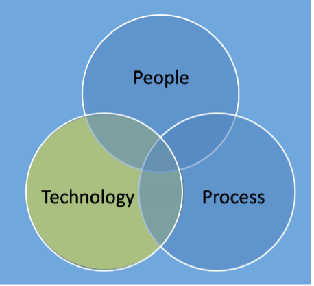
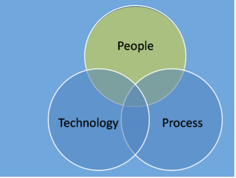
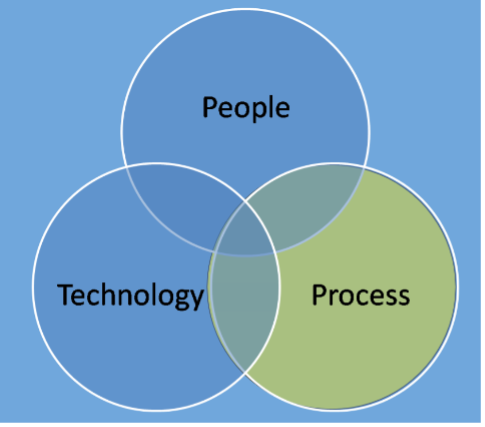

# What the FinOps?

You may (or may not) have heard the term FinOps banded about in recent times. If you're here I guess you have at least a passing interest - so, what exactly is FinOps all about?

I guess the usual immediate reaction is obviously It’s all about *money*. 
But that’s just the "Fin"…

so maybe It’s all about the *Tools*? but that’s just the Ops….  
<!--truncate-->

I suspect no one who’s ever met me will be surprised with where this is going, but I concluded that FinOps is really about...*People*! Well people, their behaviours & culture to be more specific.
"So how did I come to this conclusion?" I hear you say… well I’m glad you asked. Please settle down for a short story time :)
I’m sure there are some companies out there who have had a carefully planned strategy of how they’re wanting to move to the cloud. I’m sure for a small subset of these it went roughly to plan, but honestly, I’ve not seen it often due to the reality being full of 'exciting' surprises.
 
### Scaling Issues
 
For many of organisations the strategy often only went as far as “we should leverage the cloud” and then a few good people start doing many of the right things.  
Or  
It’s the dreaded “shadow IT” and before the wider company is aware there are already end users reliant on cloud offerings.  
 
For today’s story it’s the former:
 
It had started out as with a small footprint in the Cloud, managed by a single team. This was OK and sustainable and small enough that the team had a fair understanding of what was being used and how much was being spent on it. The one team basically did all the things and to a decent level of maturity.
 
Such was the success that in no time at all more accounts were added and more teams and even 3rd parties were working happily in the cloud. Delivering rapid change and innovation to the delight of customers.
 
So - all good right? RIGHT??? Well, this wouldn't be much of a tale if it was all smooth sailing…
 
### Key Challenges
 
* *First off, cognitive load*. It's something I’ve been thinking about a lot right now  and it’s this that’s at the core of the issue. As the cloud use rapidly scaled the small team that was once able to keep in it’s collective brain all the moving parts of what was and wasn’t running where and why very, quickly runs out of brain space. There’s no way of scaling this sensibly as the rate of cloud usage often grows exponentially.
 
NB For a way more in-depth and well described dive into the hazards of ignoring Cognitive load and how to adjust your org appropriately I'd recommend checking out the brilliant Team Topologies where it's one of the cornerstones of achieving fast flow of value.
 
* *Next*, while *Operational requirements* like up-time and performance were being focussed on, alongside application functionality of course, cost wasn’t so much. In fact the total cloud spend was running at pretty much double what anyone had estimated and getting worse
 
* To exacerbate things, and this is very common, the *Cloud budget* sat with a central IT team, while obviously most of the spend sat with software development teams. You can imagine the behaviours this drove.
 
So, when we first started to talk about FinOps approaches everyone's assumption is “*it's job is to save us money*”.  
But I don’t think that’s the right way to think about “why FinOps” and “why change how we do things”.  
Where we started it was simply *impossible to make sound business decisions* and understand really important metrics like ROI. It would have been entirely possible that a product was looking great and bringing in thousands of pounds a week, while unknowingly costing tens of thousands to run. In this case it wasn’t that extreme, but it honestly could have been.  
 
So, for me with FinOps, whilst saving money is usually one of the outcomes, to me it’s more about *spending responsibly* and awareness. Awareness of how much we’re spending and awareness of how we can spend it in the most efficient way possible. Really it harks back to LEAN concepts of reducing waste.  
 
 
### The Approach
 
Culture change can be one of the hardest things for an organisation, and don’t mistake that often that’s what we’re talking about. Finance, development, IT Operations & Platform teams all need to be thinking in a different way from what worked for on-premise and data centres. For Finance teams in particular this can be quite the journey as the old 'annual budget & purchase order sign-off' approach really falls down completely in a 'coin-operated' world like public cloud where costs and spend change by the minute, let alone monthly and the purchasing is done by developers directly and instantly.
 
### Tooling
 
  

So, for all I said it’s about people, tools are great! They’re great for tweaking people’s behaviours which in turn (in time) changes the culture.
 
First and foremost, *visibility needs to be easy* and accessible. Busy people already would rather not think about these things so simple clarity both reduces a barrier to doing something and also removes any plausible deniability and opportunities to claim, 'but I didn't know'.
 
It's important to note that the Cloud providers don’t necessarily make this as easy as it could be, so 3rd party tools really can help here - aggregating and displaying data from multiple clouds (and even on premise) in the same dashboard. In this case we did actually bring in Cloudability from Apptio (plenty of other tools are available) and it brought a lot of benefits very quickly, immediately giving *easy visibility* of-
 
* Usage
* Reservations
* Recommendations
* Multi-cloud
 
and more.
 
 
People
 
  
 
OK, we've got the tooling sorted now how about those people:
 
* First things first (as mentioned above) make it visible. Even if you don’t know who you’re going to be showing it to yet! We started by building some simple dashboards per sub-account/subscription. We would then worry about who owned each of them later.
 
* Next, find the owners - cloud compute is wonderfully traceable so it's nearly always possible to track back to who did what and when to find an owner. (Worst case scenario, switch things off and see who screams! But don't say I recommended that approach ;) )
 
This did lead to my first interactions with some very senior individuals at the organisation being something along the lines of "Hi, pleased to meet you, did you know you’re £300k over budget?". But at least I was memorable, I guess!
 
* Lastly, we started to publish *League tables* of spend month-on-month. Human nature is great if pointed in the right direction and no one really wants to be top of the spend charts - at least without a good justification as to why that is. Which prompts a need for understanding, which starts to change the culture.
 
Process
 
  
 
*The final key change was building a collective understanding* of how to use cloud services responsibly.
 
* Working together. While there’s a natural drive for people to live in their silos and optimise their area particularly, we know from the theory of constraints (do check out Dr Eli Goldratt's excellent book from 1984, it's still highly relevant) that this is rarely the best approach. And indeed, generally, cost management works best at an organisational level with everyone learning and sharing.
 
We introduced *regular catch ups* (only monthly so not too onerous) with someone representing each area and simply running through the recommendations.
* Often this we lead to budget holders *going away to ask questions* of their teams and gradually understanding more about their area. Do we need those services? Can we turn them off sometimes?
* Every month we aimed to *make more reservations* and any other appropriate actions to start to improve our collective performance.
* Started to collectively understand best practice. *Partners are important* here as we would always have questions that we may not be able to answer ourselves.
 
 
### In summary (TL; DR)
 
To pull out some key learnings around FinOps:
 
* The power that *visibility* give you is immense. Ownership comes as a handy side effect. 
 
* “*Active management*” is incredibly important. This isn’t just “one and done”, this isn’t design it right and it’ll be OK forever. Cloud native approaches have a lot of moving parts, and the Cloud providers are constantly changing their offering - new instance types, new SAS services, that may be more cost effective. 
 
* Don’t under (or over) estimate people - you really need someone to own continuously driving focus and momentum. 
 
* It’s a great opportunity for *cross team collaboration* - even where the teams aren’t working on the same thing this is always a benefit for a company.
 
* And that collaboration is also a great driver for a *virtuous cycle* of improvement. No one area wants to look “less mature” than the others.
 
Hopefully all that helps and the next time someone mentions FinOps you'll be expecting to talk people, culture, processes and tools.
