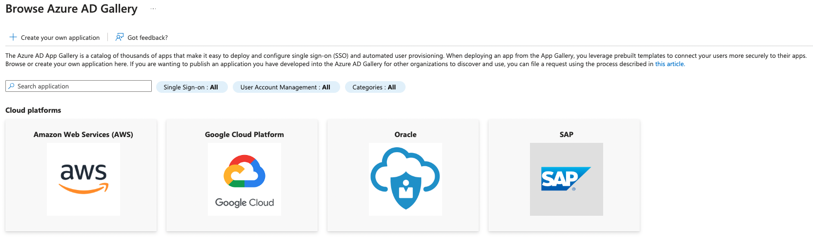
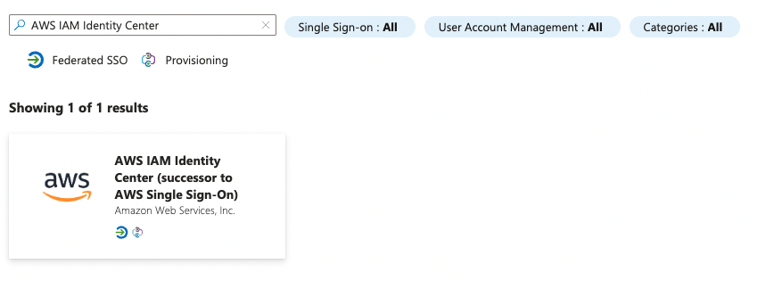
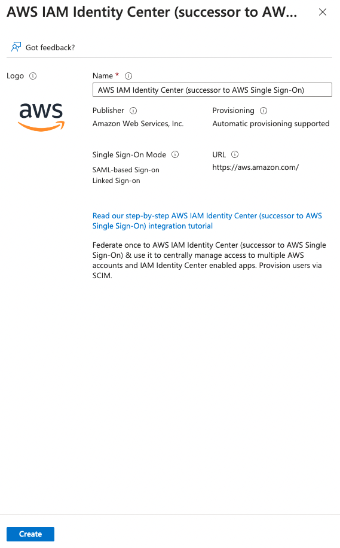
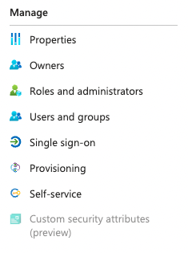
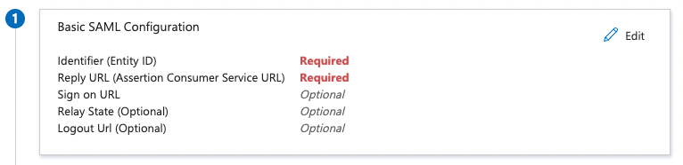

# AWS IAM and Azure AD Integration

When it comes to User Management and authentication into multiple systems, it's good practice to have a single source of truth, and this applies even for authentication into public clouds. In this blog post we will cover how to integrate Azure AD and AWS IAM Identity Center, so that you can have a central mechanism of managing users.

### Pre-requisites

In order to try this out, you will need:

1. An Azure AD subscription, you can sign-up for a free account [here](https://azure.microsoft.com/en-gb/free/)
2. AWS IAM Identity Center enabled subscription, you can read more about what AWS IAM Idenitty Center is [here](https://aws.amazon.com/iam/identity-center/)

## Enabling the Integration in Azure

While there are multiple steps to this, most of the process is handled by the Enterpise Application, which we will add to Azure AD.

### Adding the Enterprise Application

1. From Azure Active Directory, navigate to Enterprise Applications and click New application, this will give you the following screen:

   

1. Type AWS IAM Identity Center in the search box:

   

1. Hit the Create button and Azure will process this in the background:

   

### Configuring Azure AD SSO

1. Now that we have the Enterprise Application created in Azure, we need to configure it, your first step is to go to the Single sign-on section under Manage:

   

1. Select the SAML option;
1. We now have two options, to either upload a SAML file, or to configure it inside the Enterprise Application directly, we will go with the latter as it's fairly straight forward:
    1. Click the Edit button on the Basic SAML Configuration section:
        
    2. Complete the Identity (Entity ID) using the pattern `https://<REGION>.signin.aws.amazon.com/platform/saml/<ID>`, you can derive the `<REGION>` and `<ID>` values in AWS;
    3. Complete Reply URL (Assertion Consumer Service URL) `https://<REGION>.signin.aws.amazon.com/platform/saml/acs/<ID>`.

#### Configuring AWS IAM Identity Center SSO

## Wrap-up and Improvements

We have seen in this blog how relatively straight-forward this process is, and how we can make the most of Azure's ability to integrate with AWS and make your operations team lives a lot easier, not to mention reducing the security risk by having a centralised user management system.

If we wanted to take this process one step fruther, and automate the integration, we could look to use an Infrastructure-as-Code (IaC) agnostic tool such as Terraform to deploy the integration.

## Useful Links

1. https://azure.microsoft.com/en-us/products/active-directory
1. https://aws.amazon.com/iam/identity-center/

## Glossary

| Term | Meaning                                                                                                                                                                                                                                                                                          |
| ---- | ------------------------------------------------------------------------------------------------------------------------------------------------------------------------------------------------------------------------------------------------------------------------------------------------ |
| SAML | Security Assertion Markup Language: which basically means that it enables you to access multiple web applications using one set of login credentials. It works by passing authentication information in a prescribed format between two parties i.e. an identity provider and a web application. |
| IAM  | Identity Access Management: ensures that the right people and job roles in your organisation can access the apps they need to do their jobs.                                                                                                                                                     |
| IdP  | Identity Provider: stores and manages users' identities.                                                                                                                                                                                                                                         |
