# AWS IAM and Azure AD Integration

When it comes to User Management and authentication into multiple systems, it's good practice to have a single source of truth, and this applies even for authentication into public clouds. In this blog post we will cover how to integrate Azure AD and AWS IAM Identity Centre, so that you can have a central mechanism of managing user accounts.

<!--truncate-->

### Pre-requisites

In order to try this out, you will need:

1. An Azure AD subscription, you can sign-up for a free account [here](https://azure.microsoft.com/en-gb/free/)
2. AWS IAM Identity Centre enabled subscription, you can read more about what AWS IAM Identity Centre is [here](https://aws.amazon.com/iam/identity-center/)

## Enabling the Integration in AWS Part 1

Before we can tell Azure about various values it will need in order for the integration to work, we will need to configure IAM Identity Centre first.

### Configuring the Identity Source in AWS IAM Identity Centre

1. From the AWS Management Console, go to the IAM Identity Centre, where you will be presented with the Dashboard:
   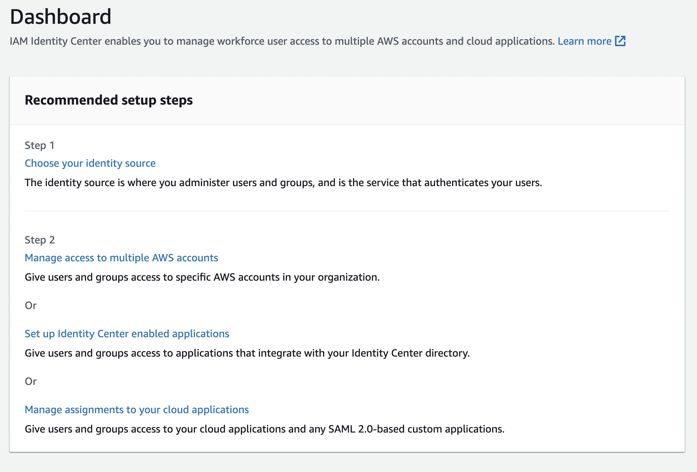

1. We're going to configure the identity source so that AWS knows that we will be centrally managing user access from Azure, so select 'Choose your identity source';

1. Select 'External identity provider' on the next page:

   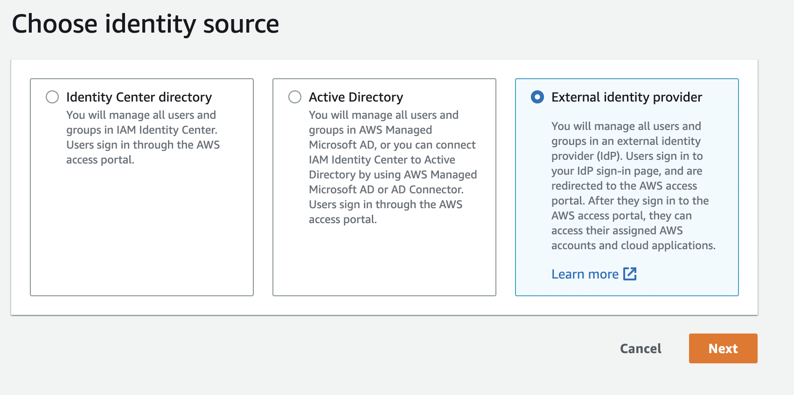

1. On the following page, this is where Enabling the Integration in AWS Part 1 ends, click 'Download the metadata file' and [keep it secret, keep it safe](<https://tolkiengateway.net/wiki/Keep_It_Secret,_Keep_It_Safe_(scene)>).

## Enabling the Integration in Azure Part 1

While there are multiple steps to this, most of the process is handled by an [Enterprise Application](https://learn.microsoft.com/en-us/azure/active-directory/manage-apps/add-application-portal), which we will add to Azure AD.

### Adding the Enterprise Application to Azure AD

1. From Azure Active Directory, navigate to Enterprise Applications and click New application, this will give you the following screen:

   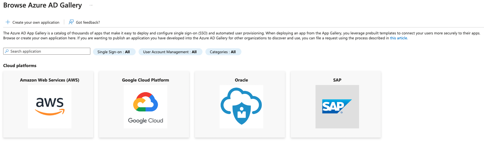

1. Type AWS IAM Identity Centre in the search box:

   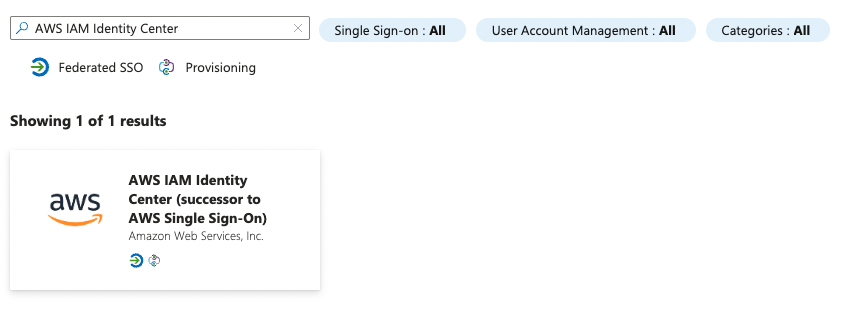

1. Hit the Create button and Azure will process this in the background:

   

### Configuring Azure AD SSO

1. Now that we have the Enterprise Application created in Azure, we need to configure it, your first step is to go to the Single sign-on section under Manage:

   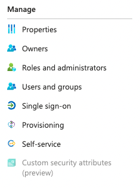

1. Select the SAML option;

1. We now have two options, to either upload a SAML file, or to configure it inside the Enterprise Application directly, we're going to upload the SAML file we just downloaded from AWS via the 'Upload metadata file':

   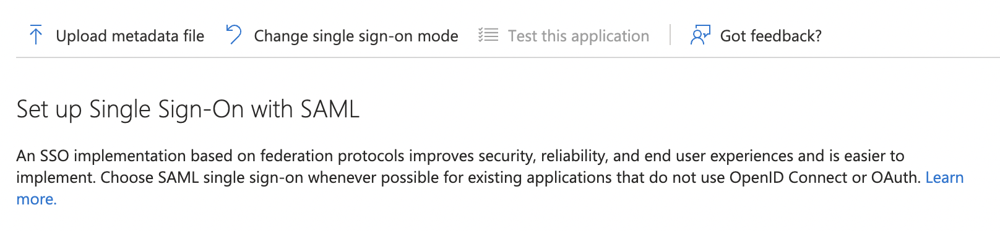

1. Once that's done you will notice that Azure has kindly populated the Basic SAML Configuration, for example:

   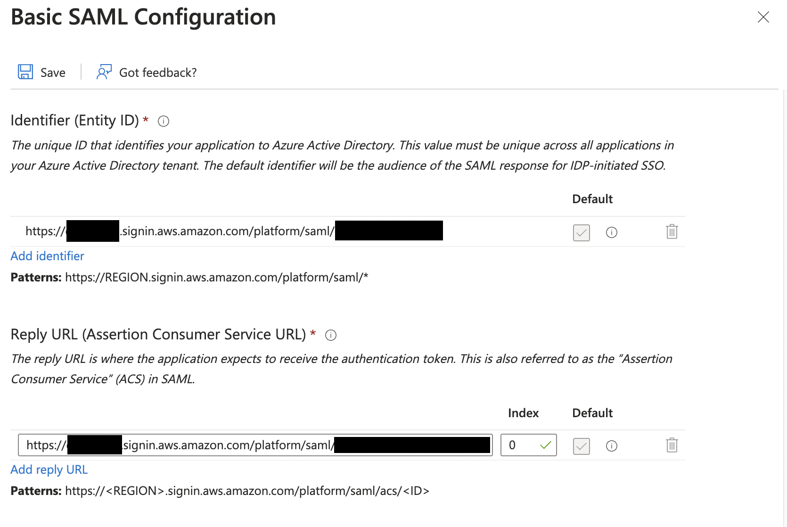

1. Hit Save, and then download the Base64 SAML Certificate and Federation Metadata XML:

   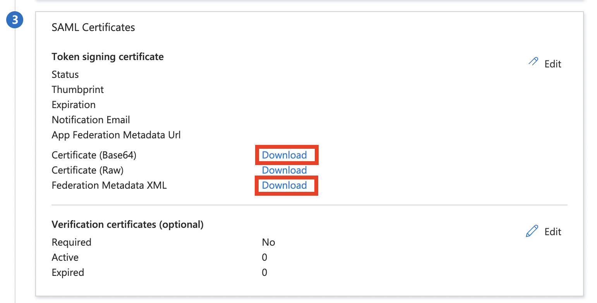

1. This is where Enabling the Integration in Azure Part 1 ends

## Enabling the Integration in AWS Part 2

1. At the end of [Enabling the Integration in AWS Part 1](#enabling-the-integration-in-aws-part-1), we were on the `Configure external identity provider' page. We want to upload the Base64 SAML Certificate and Federation Metadata XML we downloaded at the end of [Enabling the Integration in Azure Part 1](#enabling-the-integration-in-azure-part-1) here:

   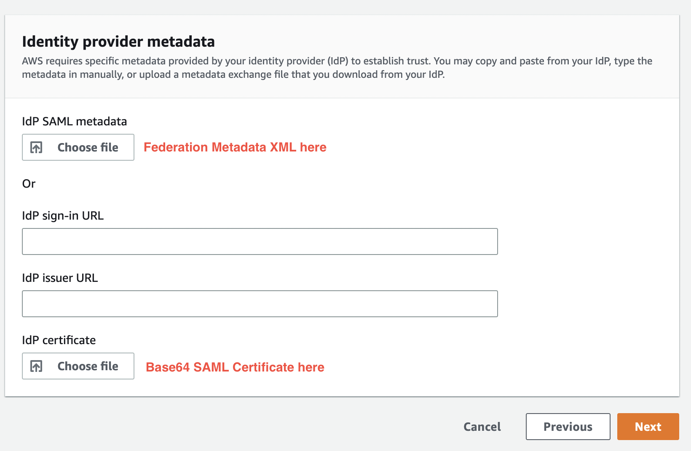

1. Make a note of the `AWS access portal sign-in URL' as you will need this in [Enabling the Integration in Azure Part 3](#enabling-the-integration-in-azure-part-3) and for testing the integration:

   

1. AWS is going to want to agree to a bunch of things, it's worth reading through, once you're type type 'ACCEPT' and hit 'Change identity source':

   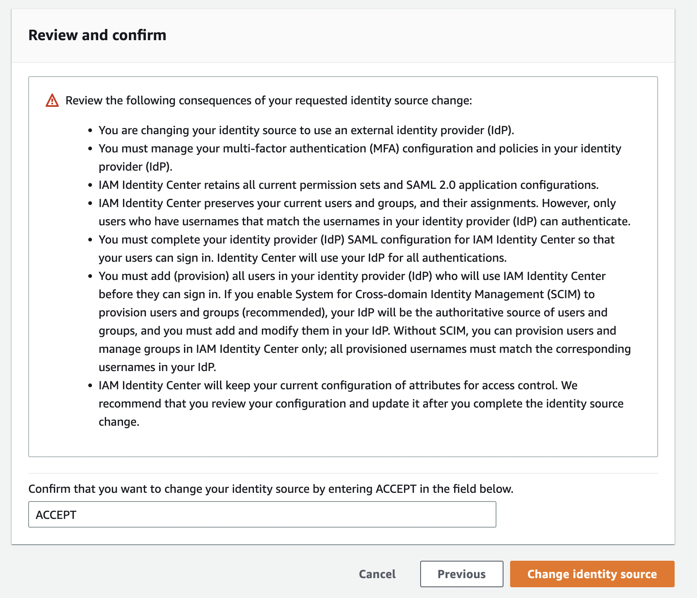

## Enabling the Integration in Azure Part 3

1. Back in Azure, go to the Single sign-on section, and under Section 1, and enter the 'AWS access portal sign-in URL' we copied earlier and save the configuration again:

   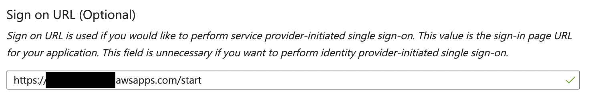

1. That wraps things up configuration-wise, now we want to test!

## Testing the Integration

### Create an Azure AD User

1. From Azure Active Directory, create a new User and make a note of their username i.e. `azure-aws-test@your-domain.com`
1. We want to assign this User to the AWS IAM Identity Centre Enterprise Application:

   1. Go to the Enterprise Applications in Azure;

   1. Select the AWS IAM Identity Centre application, then click Users and Groups:

      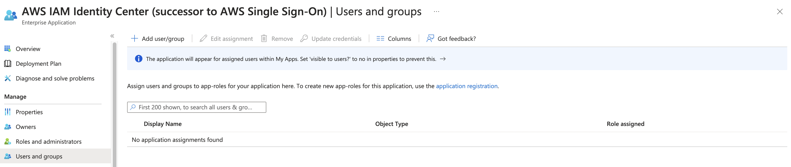

   1. Add the User we created in Step 1:

      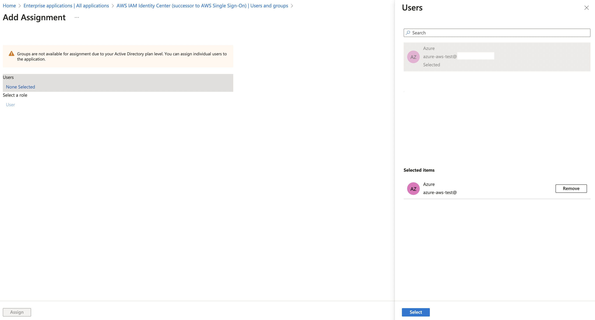

### Create an AWS User

1. From the AWS IAM Identity Centre console create a new User with the same details as the Azure user

   > :warning: Ensure the username for AWS IAM Identity Centre and Azure AD are the same.

### Test the Sign-in URL

Open a browser and put the sign-in url in there that we used for [Enabling the Integration in Azure Part 3](#enabling-the-integration-in-azure-part-3) and you will notice you will be re-directed to a Microsoft sign-in page, enter the credentials and you will then see an AWS landing page:

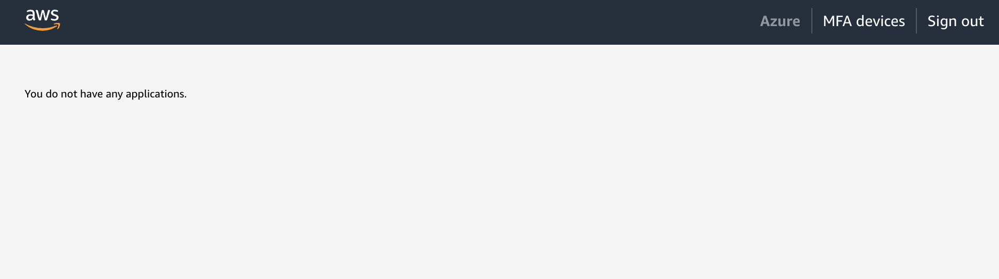

## Wrap-up and Improvements

We have seen in this blog how relatively straight-forward this process is, and how we can make the most of Azure's ability to integrate with AWS and make your operations team lives a lot easier, not to mention reducing the security risk by having a centralised user management system.

If we wanted to take this process one step further, and automate the integration, we could look to use an Infrastructure-as-Code (IaC) agnostic tool such as Terraform to deploy the integration.

## Useful Links

1. https://azure.microsoft.com/en-us/products/active-directory
1. https://aws.amazon.com/iam/identity-center/
1. https://learn.microsoft.com/en-us/azure/active-directory/fundamentals/auth-saml

## Glossary

| Term     | Meaning                                                                                                                                                                                                                                                                                              |
| -------- | ---------------------------------------------------------------------------------------------------------------------------------------------------------------------------------------------------------------------------------------------------------------------------------------------------- |
| **SAML** | **Security Assertion Markup Language**: which basically means that it enables you to access multiple web applications using one set of login credentials. It works by passing authentication information in a prescribed format between two parties i.e. an identity provider and a web application. |
| **IAM**  | **Identity Access Management**: ensures that the right people and job roles in your organization can access the apps they need to do their jobs.                                                                                                                                                     |
| **IdP**  | **Identity Provider**: stores and manages user account identities.                                                                                                                                                                                                                                   |
