In this blog post we will explore how simple it is to create an [event driven architecture](https://learn.microsoft.com/en-us/azure/architecture/guide/architecture-styles/event-driven) using Azure's Logic Apps. We will create supporting services such including Azure Service Bus which will act as the event trigger for the Logic App to run, and Twilio, which will allow us to send an SMS message. You will probably familiar with receiving notifications whenever you order something online, so this will give you a flavour of what's involved to set this up in Azure.

If you want to find out more about what Logic Apps are, then keep reading, if you just want to get into the example, [feel free](#creating-a-notification-service-using-logic-apps).

<!--truncate-->

### Pre-requisites

In order to try this out, you will need:

1. An Azure AD subscription, you can sign-up for a free account [here](https://azure.microsoft.com/en-gb/free/);
2. A Twilio account, which you can sign up for free [here](https://www.twilio.com/try-twilio);
3. A basic understanding of [JSON](https://www.w3schools.com/whatis/whatis_json.asp).

## What are Logic Apps?

Before going into what we'll be doing, it's probably worth understanding what Logic Apps are: Logic Apps are a Microsoft low-code serverless technology that allow you to build workflows inside of a visual designer, and connectors enable you implement integrations with third-parties. If you have any familiarity with [AWS Step Functions](https://aws.amazon.com/step-functions/), then you'll feel at home here. Logic Apps have many triggers, including events and timers, we will cover off what we mean by an 'event' below.

### What is an Event to a Logic App?

An event in a Logic App are defined using triggers, and this is what starts the execution of a Logic App; different types of triggers can include:

1. Azure services such as a Service Bus that will we will be creating here;
2. Software-as-a-Service (SaaS) applications;
3. Custom APIs.

### What are Logic App Connectors?

Connectors are pre-built pieces of logic that act as steps in your Logic App workflow, for example sending data to an external system; Connectors will often need configuring i.e. providing some kind of authentication for the system they are integrating with. You can read more about Connectors [here](https://learn.microsoft.com/en-us/azure/connectors/introduction).

## Creating a Notification Service using Logic Apps and Azure Service Bus

The following steps will show you how to set up the relevant pieces in Azure to create the notification service.

### Setting up the Azure Service Bus

An [Azure Service Bus](https://learn.microsoft.com/en-us/azure/service-bus-messaging/service-bus-messaging-overview) instance will be needed so we can create a message queue to store the messages that will be used as the event; to create this, from the Azure Portal, search for Azure Service Bus:

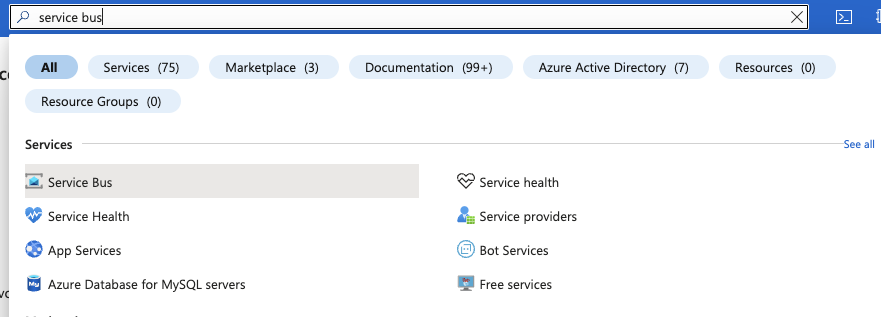

Next, go ahead and create a Service Bus with a logical name, you don't need to worry about the advanced options for this example.

:::caution

For the pricing tier, ensure you select Basic to make sure you're not incurring unnecessary costs.

:::

Finally, we will need to create something known as a Shared Access Policy. We need this so that the Logic App has permission to talk to the Service Bus. From the Service Bus screen, go to the Shared access policies section and click Add; we want to follow the [least privilege principle](https://learn.microsoft.com/en-us/azure/active-directory/develop/secure-least-privileged-access) here, so let's only give it Listen as part of the SAS Policy:

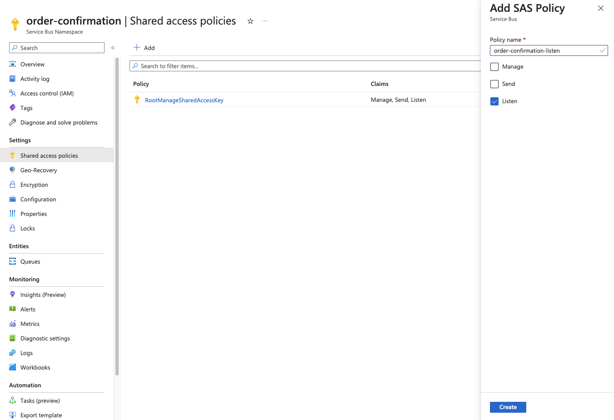

Once this is created, copy the Primary Connection String as we will need this later:

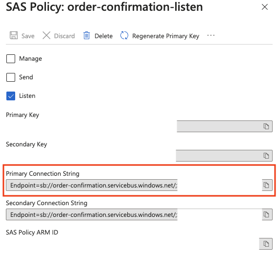

### Creating the Message Queue

Now that we have a Service Bus setup, we can now go ahead and create a queue. From the Service Bus screen, create a queue with a name that's related to the consumer i.e.

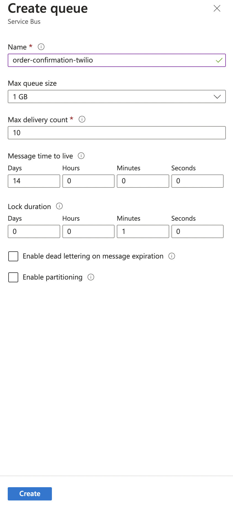

Okay, we now have the pieces in place that will create an event for the Logic App to consume.

:::info

As we're only using a Basic setup, we don't have the option to create a Topic, which is beyond the scope of this blog, you can read more about what Topics are and how you could use them [here](https://learn.microsoft.com/en-us/azure/service-bus-messaging/service-bus-queues-topics-subscriptions#topics-and-subscriptions).

:::

### Configuring a Logic App to send notifications

Now for the fun part, from the Azure Portal, search for Logic Apps:

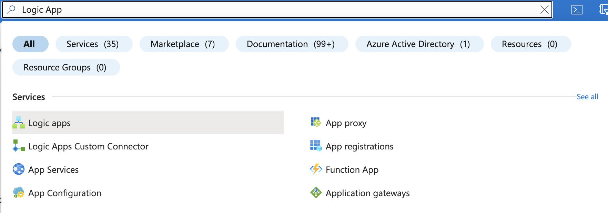

Create a Logic App, again with a logical name that reflects what it will be doing. Azure will give you a list of predefined starter options, which is useful, as we will use the first one 'When a message is received in a Service Bus queue'

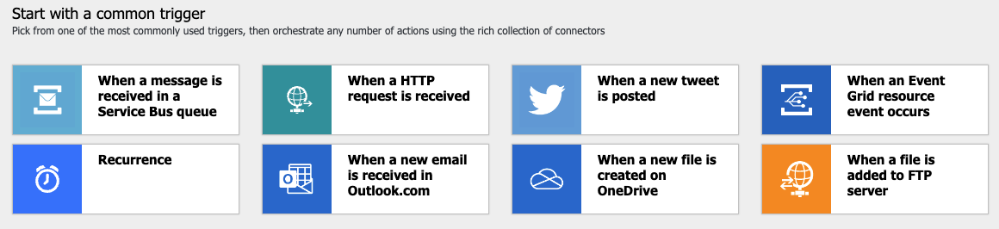

:::info

Ensure you create the Logic App in the same region as the Azure Service Bus above, this will improve the speed of the overall service and is generally best practice.

:::

In the Logic Apps Designer, the first part we will configure is connecting to the Service Bus, you need the connection string we copied as part of setting up the SAS Policy, paste that in and hit Create (as a side note, this will create an API Connection in Azure, which you can view/edit by searching API Connections in the Azure Portal).

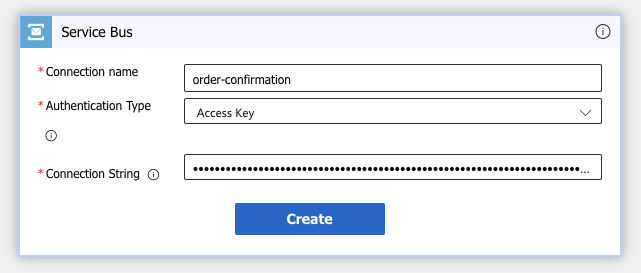

Once this has been created, you will be prompted with setting up which queue you want to connect to, enter the name of the queue and configure a cadence for how often you want the Logic App to check the queue for new messages, once you've done that, click Next Step:

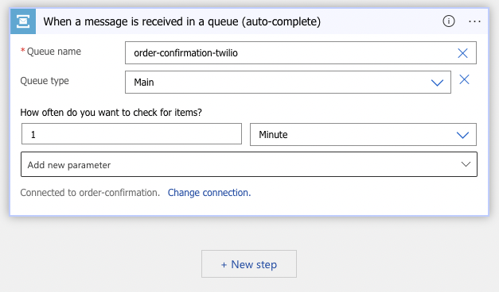

For the next step, we want to tell the Logic App to parse the body of the message, so search for JSON and select the 'Parse JSON' action:

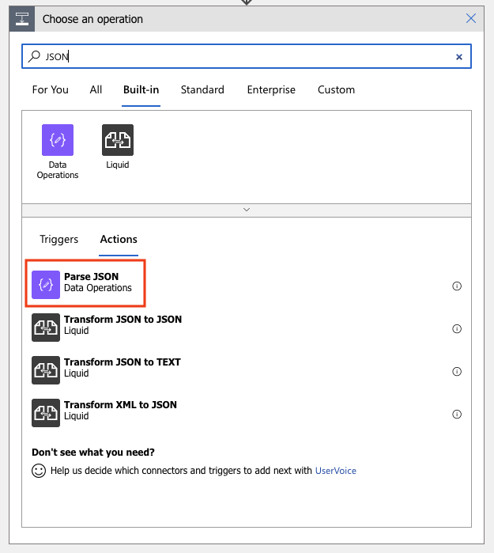

We're expecting the message to contain a JSON message payload, an example of this being:

```json
{
  "customerName": "Brian",
  "customerPhoneNumber": "07777777777",
  "orderNumber": "0123456789"
}
```

The Parse JSON action wil let us create a [JSON Schema](https://json-schema.org/) so that we don't have to manually come up with one.

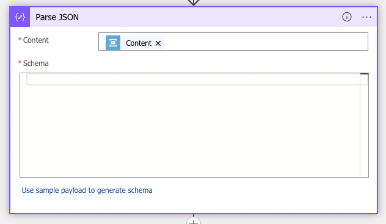

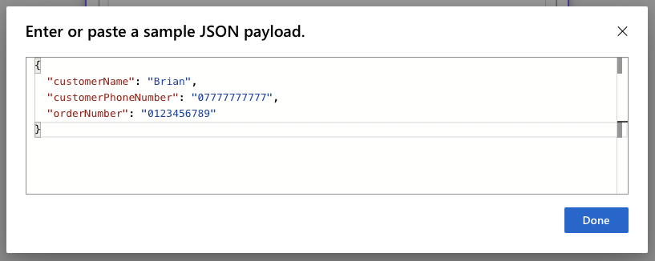

This will then generate a nice schema for us to use in future steps:

```json
{
  "type": "object",
  "properties": {
    "customerName": {
      "type": "string"
    },
    "customerPhoneNumber": {
      "type": "string"
    },
    "orderNumber": {
      "type": "string"
    }
  }
}
```

For the Content, we will need to do a little bit of code for this, which looks like`json(base64ToString(triggerBody()?['ContentData']))`, the reason for this is that the message lands on the queue as a base64 encoded string:

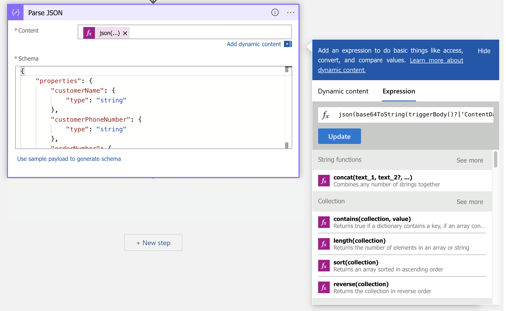

We can now add the Twilio integration, this is a built in Action so as before, just search for Twilio and select it:

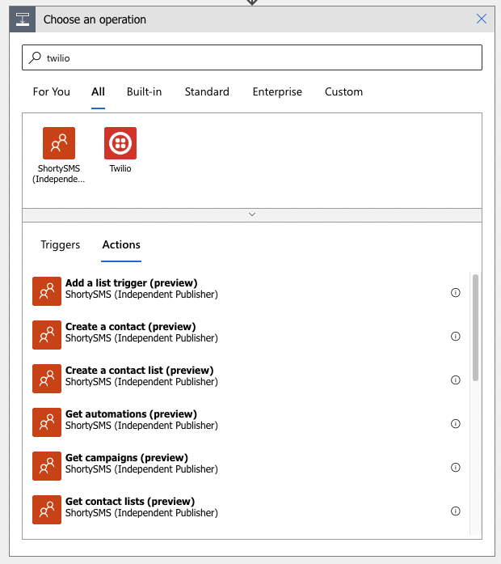

As we want to send a message, select Send Text Message:

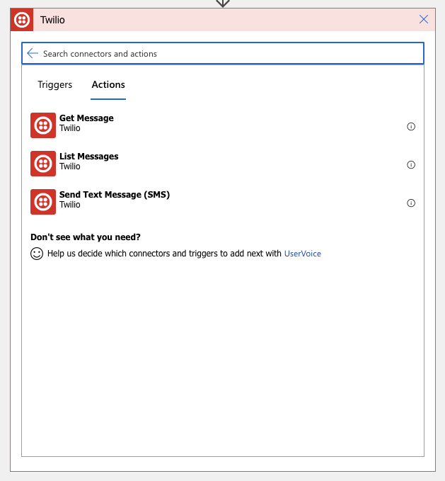

As part of the [pre-requisites](#pre-requisites) for this, you should have set up a trial Twilio account, which you'll need for the next step of configuration, you can find the information you need for this in your Twilio account:

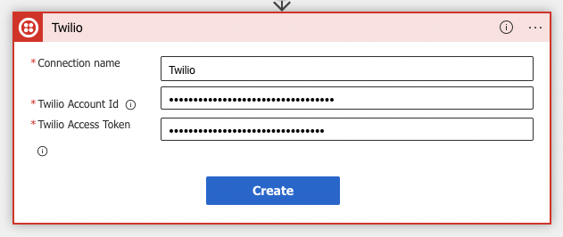

Here's the great thing about setting up the JSON schema earlier, the Logic App will let you add dynamic content based on data that has been set in prior actions to this one, so we can set the 'To Phone Number' with the `customerPhoneNumber`and create the body of the text message using other information

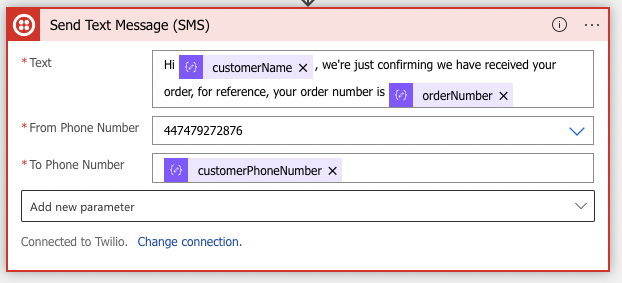

That's it! We have created a notification service with very little code, in the next step, we will test the notification.

### Testing the Logic App

In order to test the service, we need to add a message on to the service bus queue. From Azure, go to the queue we set up [earlier](#creating-the-message-queue) and then navigate to the Service Bus Explorer. We can add a message to the queue from inside Azure by just using 'Send Message':

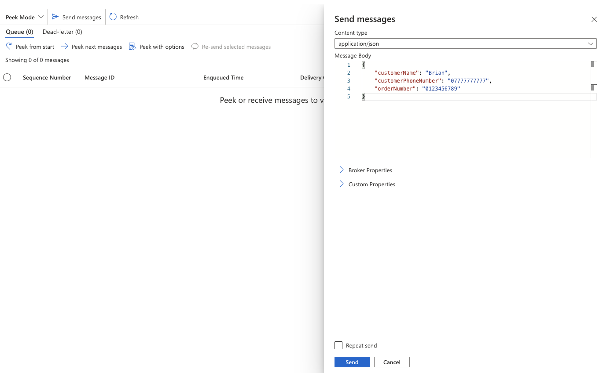

Depending on how long you set your Logic App to monitor the queue for, you should receive a message to your phone:

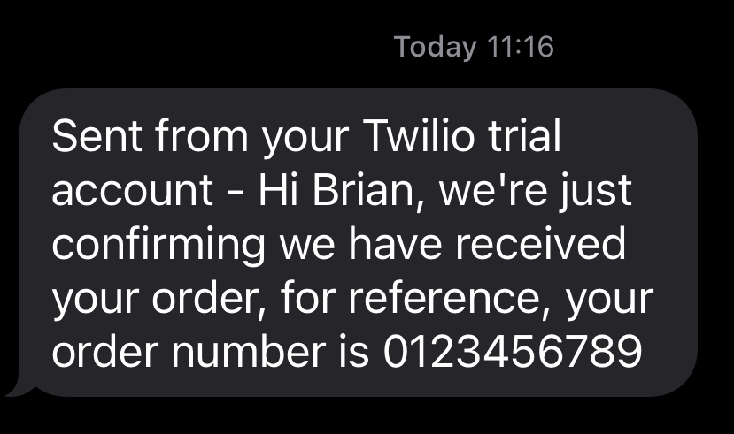

Obviously if you pay for a Twilio service you will not have the trial account information in the text message, but, other than that, our service is working!

## Wrap-up and Improvements

From this very basic example we can see how simple it is to create event driven architecture in Azure using very few components. Ideally, this solution should be easily deployable and not done through the Azure Portal, so we could look at using something like [Terraform](https://www.terraform.io/) to deploy this, Microsoft's preferred Infrastructure-as-Code (IaC) provider is [Bicep](https://learn.microsoft.com/en-us/azure/azure-resource-manager/bicep/overview?tabs=bicep). Another point, this example does not cover any kind of resilience you would want to implement in a service like this (or any service, really), such as what happens when the integration between Azure and an external service fails. Finally, there should be some sort of automated testing around this, such as [Newman](https://learning.postman.com/docs/collections/using-newman-cli/command-line-integration-with-newman/) to run as part of our deployment process mentioned earlier.
