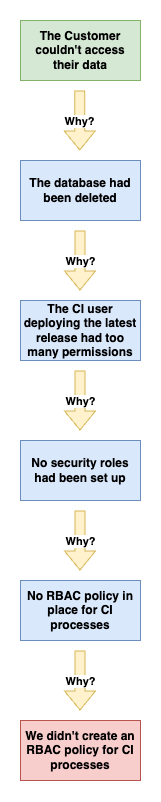

In this blog we're going to look at what 5 Whys technique and how it can be used to help get to the bottom of a problem when troubleshooting an incident that might occur as part of software delivery. It's not a silver bullet, however, used correctly it can be a powerful and simple tool for a team to use when wanting to both find out what happened and how the team can improve their processes.

<!--truncate-->

## What is 5 Whys?
We're starting the discussion with a What rather than a Why 🤭. 5 Whys analysis is a tool you can use to investigate the causality of a problem, from this analysis you can then go on to create actions to then mitigate this issue ever happening again - this is the key point, you can do the investigative work as much as you want, but if there's no action afterwards, it has been a theoretical exercise.

## A Scenario to Analyse
Imagine the scenario - a customer calls complaining they cannot see their data when they login to your new shiny application that is deployed to Cloud Provider X, there is a Priority 1 incident raised and you realise that a production database has been deleted, oops! You restore the database from a backup and get on with your day, right? No, you need to get to the bottom of the problem with how the database disappeared from a production system.

### Get the Team Together
There is no point in one person trying to figure out how this happened, so you should gather a team of people that were involved in resolving this incident, as with anything that needs critical thinking, it's better to do this in a group.

### Set out the problem
This will help define the first 'Why?' we will ask during the process, in this instance, it helps if we think from the customer's point of view as this is where the source of the issue came from - they couldn't access their data, why?

### 4 More Whys to go
Below is a diagram of how this could look, it's important to note that you don't have have to strictly stick to 5 here, you can use fewer, or indeed more, if there is value in determining the causality of the problem.

## Taking Actions
We can see from the above worked example that there was no security policies in place for the CI user that was deploying new releases to production and the action would be the inverse of the final step - to put in place a security policy for the CI user.

## Summary
5 Whys can be a very effective tool at ascertaining the root cause(s) of problems that might occur within the context of a software solution, it needs the support of the team in order to have the most useful impact and it should be used in the open, so that we learn from mistakes and we take actions to reduce the risk of those mistakes happening again.

## Useful Links
1. https://www.mindtools.com/a3mi00v/5-whys - A discussion on 5 Whys and its origins and implementation
1. https://www.england.nhs.uk/improvement-hub/wp-content/uploads/sites/44/2015/08/learning-handbook-five-whys.pdf - NHS England's training within the context of a health provider
1. https://miro.com/templates/5-whys/ Miro's explanation along with some useful starter boards (if you use Miro)
