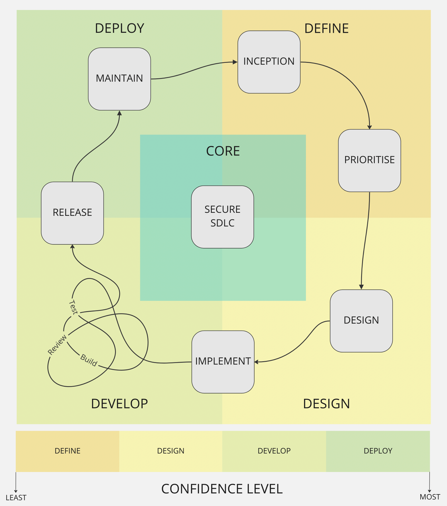

# The Burendo Software Development Life Cycle (SDLC)

## What is role of the SDLC?

The SDLC presents a consistent and standardised, yet flexible framework that helps users define activities and deliverables(work).  Using this framework we can build a picture, that can be understood at all levels, of how work can be taken from inception to implementation and beyond.  Once in place and its concepts are used by all, it creates higher velocity of output, increased trust between all parties involved and more creative freedom within the bounds set by the framework.

## The four D's

We believe the four D's create the foundational concepts that underpin the SDLC.  These foundational concepts will remain consistent, even if the concepts placed over the top of them change and evolve over time.

### Core

The Core concept is the concept we do not control and why it is one of the most important concepts to understand and assess first when applying the SDLC.  
This concept is centred around the philosophy _"The client gets a vote"_.  No matter how confident you are in the application of all the other SDLC concepts, ultimately the client has a say in how they are applied.  It's very rare we will get a totally green field opportunity, and it's likely the client already has processes in place, over-arching governance or frameworks to adhere to, _(or all of the above)_. These client driven factors will influence the application, and content of the [stages](#the-six-stages) that sit on top of the foundations built by the 4 D's.  When assessing these factors we can not control, we always do this knowing that no undertaking ever goes according to plan, especially when those plans are overly complex. By having the below simple foundations to build on, that everyone, including the client can understand, means we can adjust and adapt to each clients needs, whilst being able to deliver a complete SDLC.

### Define

The _*Define*_ concept addresses factors like; 
- How do we take on work? 
- How do we apply filters to ensure we're doing the right thing at the right time?  
- How do we know we have all the information required to start?  
- What does good look like?  
- What does value look like?  
- How important is this?
- What security concerns do we need to understand?

### Design

The _*Design*_ concept addresses factors like; 
- How do we ensure we understand what we should be doing.
- What external factors will influence our design?
- Are there 3rd parties to take into consideration?
- What previous choices influence our design?
- What security concerns do we need to understand?

### Develop

The _*Develop*_ concept addresses factors like; 
- How do we create what we should? 
- What is our definition of done?
- How do we build confidence in what we have produced?
- What previous choices influence our development?
- What security concerns do we need to understand?

### Deploy

The _*Deploy*_ concept addresses factors like; 
- How do we publish what we created?
- How do we ensure longevity and improvements in what we have produced?
- How do we observe these changes?
- How do we formulate improvements?
- What security concerns do we need to understand?

## The Six Stages

The following six stages make up the cyclical process most people are familiar with, building off the foundational concepts covered above.  We are able to confidently identify _what_ we want to do within each stage, without getting into the how.  The how, as explained above in the [Core concept](#core), will be heavily influenced by many factors and will inevitably look quite different between implementations.

### Inception

[The beninging](https://www.youtube.com/watch?v=vacJSHN4ZmY).  The traditional front door.  Generally there are two main drivers at this stage, work driven by business value and work driven by improvements on previous work.  

### Prioritise

It's important at this stage to engage with stakeholders and truly understand the value to the business when making decisions.  This is a two way street, as improvements may trump new work, especially when considering security and customer effecting defects.

### Design

How or what are we going to do? The feedback and engagement both upward and downward becomes much more important from this stage.  Although the implementers, may well be engaged in earlier stages, this is really where those executing the design may start to influence the outcomes in earnest.

### Implement

[Do it!](https://www.youtube.com/watch?v=K4eScf6TMaM) The execution phase.  Here's where we begin to see the fruits of our labour.  One of the most important [cycles within a cycle](#cycles-within-cycles) starts here.  

### Release

This is where consumers of our efforts begin to feel the value.  The consumers can both be business oriented and customer oriented consumers.  We preferably release fast, small changes applied via automated processes.

### Maintain

One of the largest challenges to overcome, is to observe and understand your system well enough you can foresee issues before your consumers do. This is one of the primary focuses of the maintain stage.  Through this we are able to incept work through the improvement channel, and the cycle begins anew!

## Cycles within cycles

The SDLC is not just a linear process.  Describe loop backs like build/test/review.

## The grey line

Some stages sit in more than one area.  Explain this reasoning.
