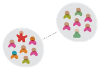

# The Remote Scrum Guide

## Purpose of the Remote Scrum Guide

Remote Scrum is a framework for developing, delivering and sustaining complex products remotely. This guide concentrates on how to enable autonomy, facilitate events, drive empiricism and implement scrum rules remotely with a distributed team. This guide is not intended to replace the scrum guide but to be a companion guide for working in remote and distributed scrum teams

## Definition of Remote Scrum

Remote Scrum: A framework that is based based on the scrum guide with added elements of remote working principles that support the roles, events, artifacts and rules. In so doing deliver products of the highest possible value.

## Understanding what it means to be remote.

Working remotely can conjure many different ideas of what remote teams and remote working are. In this guide we can break it down according to Martin Fowlers four basic models of co-located and remote working.
  
  

### Single Site

A single site team is a team that is co-located in the same physical location. This means you have almost immediate access to each other and are able to communicate and elaborate quickly and effectively.

### Multi-site

A multi-team site has two or more co-located groups in separate locations. These teams may have some formal boundaries and responsibilities.

 

### Satellite Workers

Satellite Workers occur when you have most of the team co-located with a few members working remotely either from home or another office

### Remote First

A remote first team is one where everyone works in a separate location. Which means all communication occurs exclusively online. Think of open source software development or Covid lockdown working.

Understanding what remote setup you are working will help in understanding what approach to take when working with remote teams.

 

## Communication

Build in Face to Face interactions into the team
>“The most efficient and effective method of conveying information to and within a development team is face-to-face conversation.”  
(Agile Manifesto Principle)

If you cannot be in the same space to interact on a face to face basis, look for ways that you can meet together often, whether that frequency be daily, weekly, monthly or yearly. Make time for it where possible.

Traveling to meet for meetings may not always be possible or sensible so the next best thing of adding face-to-face interactions is video chats.

Video chats are not for everyone or every meeting but it is important that that some meetings, video should be encouraged. For example retrospectives and planning where face to face would be very beneficial. Make it a habit of using video in one to one meetings

## Tools

### Removing delays

As a scrum master, removing impediments now includes training your teams on using your collaboration tools. Scrums masters need to help the team understand how to get ready for meetings etc.

There is a lot of waste that occurs at the start of calls, such as connection issues, echos, double mute and so on. Look at ways of reducing that waste, such as getting headsets, proper hardware setup, tools training and guides.

It is possible to calculate the cost of that waste. How much time is wasted on each call multiplied by the number of events you have and then across multiple scrum teams. It quickly adds up and can easily justify the cost of new equipment or training.

### Collaboration tools

There is a plethora of online tools that can be used for collaboration from communication tools, virtual white boards, video conferencing, Scrum boards, workflow tools etc. As a Scrum Master look to minimise the amount of tools you use as a team. Reducing the number of tools used will promote a sustainable environment that will reduce context switching.

When using collaboration tools, it’s best that every member of the team is on an equal footing. So if you are a multi site team use tools that promote collaboration they both sites can use. If you have a hybrid, why not go fully remote so that everyone can contribute efficiently and effectively.

In remote first teams, work with your organisation to ensure everyone has the right equipment including solid and stable internet connections.

Another question you can ask as a scrum master is ‘Is the equipment we have fit for purpose?’ Do your teams require writing slates, external webcams or anything else that improves the efficiency of the team.

### Remote Working Agreement.

In order to be an efficient scrum team we should have a definition of understanding.

- How do we contact each other on a 1-2-1 basis?
- How do we schedule conversations
- How do we indicate availability to communicate (Or a lack of it) How do we collaborate on design activities?
- How do we do team meetings?
- How do we handle Kanban boards?

## Scrum Roles 

### Scrum Master

Scrum team embrace the Scrum Values of Commitment, Courage, Focus, Openness and respect. These values still apply when working remotely. The team have the courage to be open about their issues in dealing with the situation. The Scrum Team members commit to the team goals and are focused on the work at hand.

### Services to the Scrum Team

The primary role of a scrum master is to remove impediments, facilitate and coach the team in scrum and agile. In order to do this we need to change the way we do approach this.

### Communication

As a Scrum Master you will need to be proactive in looking after the Scrum Team. You can achieve this through regular contact with the team. Some ways you can do this is by:

- Direct messages - Message your team members regularly and see how they are doing. There may be a need to probe a little more to get a feel for how they are really doing. Offer assistance and support and follow through with any actions. This builds trust and respect amongst the team.
- Audio calls - Audio calls can convey important information by listening to how the team member says something.
- Video Calls - For one to one interaction Video chat is as good as it gets in the remote first world.

Ensure that your team meet together often. Use your standups to plan your day, and time permitting talk about your day in general. Allow the team to share their thoughts and experiences with the team.

Arrange virtual coffee breaks where you can have an informal chat. As an example you can schedule a 15 min call with the team 3 or 4 times a week or every day!

### Coaching

Be open with what you want the team to learn about Scrum and Agile. Share the teams progress often, use metrics to highlight where you can improve and have these insights readily available to the team.

Use your retrospective to teach a new principle and pin that principle to your chat for the team to reference.

### Self Organisation

Teams should still be able to self organise. Doing this remotely does offer some challenges, but using the scrum empirical process of transparency, inspection and adaption we can achieve this.

Give the team the autonomy to find out what works for them and adjust accordingly.

Keep an eye on your teams group chat

Have regular chats with the team members

Look for patterns that are brought forward at the sprint review.

Monitor your board (JIRA) and ensure issues are regularly updated. 

Ensure information is kept up to date and make sure it can be easily found

### Services to the Product Owner

The product owner needs to align with the development team and stakeholders to maximise the value of the product. Where as a scrum team may be used to working remotely, the stakeholders may not be. As a Scrum Master you can work to identify solutions that are suitable to your stakeholders and PO. Look at ways of doing sprint reviews remotely whether by Teams or Zoom etc.

Consider having check ins with your PO on a regular basis. Look to help using digital roadmap tools that are transparent to the organisation.

### Services to the organisation

Scrum Masters can work together to propose new tools, techniques, best practices and ways of working in a remote environment.

Scrum masters can look at how the organisation engages with the scrum teams and ensure the organisation understands what it means to engage with a remote scrum team.

Consider creating a ‘intake’ channel where stakeholders can request new work. Development teams can redirect requests to the intake channel. This can help control interruptions in remote teams.

### Artifact Transparency

A Scrum Masters job is to ensure that the artifacts are transparent to the stakeholders, Product Owner, Development team and the Organisation.

Once the artifacts are transparent using Digital dashboards, confluence pages etc. A scrum master needs to ensure that all the artifacts are complete and up to date to ensure complete and accurate transparency.

Addressing impediments
