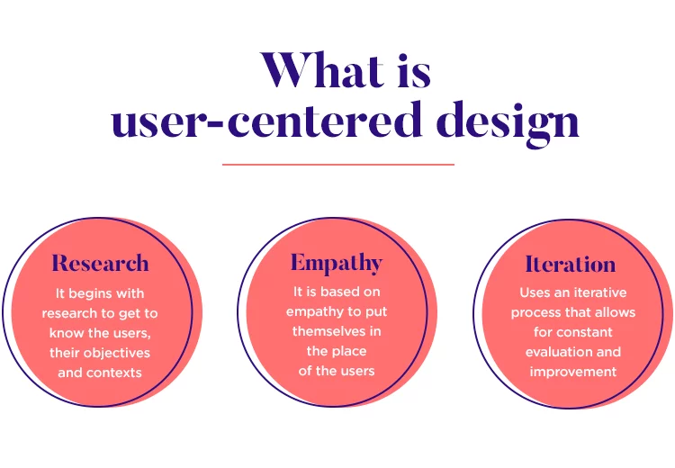
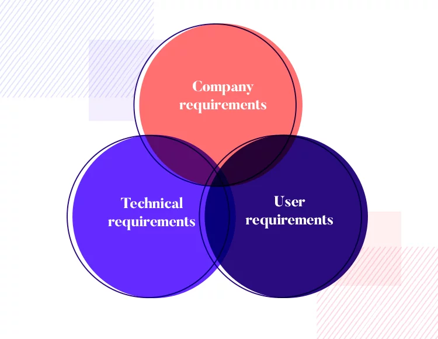

# What is User Centred Design?

User-centred design (UCD) is a _*philosophy or framework*_ where we set out to _*create a product*_ that _*reflects the user needs*_ and preferences. 

>“User-centred design (UCD) is an iterative design process in which designers focus on the users and their needs in each phase of the design process.” - _*Interaction Design Foundation*_ 

### User research: developing a deep understanding  

As you might have guessed, _*understanding the user*_ and the user’s problems is _*absolutely crucial*_. User research is a necessary building block in user-centric products, with its findings both guiding and supporting all design decisions from this point on.

### Empathy: putting yourself in another's shoes  

When designers engage with the users, they can get information on how the users _*think, behave, feel, and what their values are*_. Most of the time, these kinds of things are not clear even for the users.
Questions like "how" and "why" are crucial to understanding users' behaviour. Communication is vital to understand and empathise with users.

By doing this, designers can also _*uncover needs that haven't been previously met*_, or even identified, and this can lead to _*new solutions that have never been thought up*_.

### Requirements gathering and aligning  

Once you’ve got a _*clear idea*_ of who you’re designing for and _*what their problem is*_, you can start to _*slowly define*_ what you could do to _*solve this problem*_. This is when you start to consider what factors you can influence with your product and how, both in technical and design terms. But something else comes into play here – aside from the _*design requirements*_, there are also _*business requirements*_.

  

This is the moment to try and find common ground. While designers want to fix the problem in a certain way, this may not coincide with business stakeholders who seek to profit from the entire venture. It’s important for the overall health of the project that both sides agree on what the true requirements are, so that the project is sustainable in the long haul.

### Ideate solution: from bare bones to hi-fidelity  

Once we know what we’re doing and who we’re doing it for, comes the fun part: _*ideation*_. This is where designers get to play around and see how their ideas play out. This stage can be found all around the design industry, with each design team carrying the stage out in their own way.

*content and graphics paraphrased from: [User-centered design: a beginner’s guide](https://www.justinmind.com/blog/user-centered-design/)
