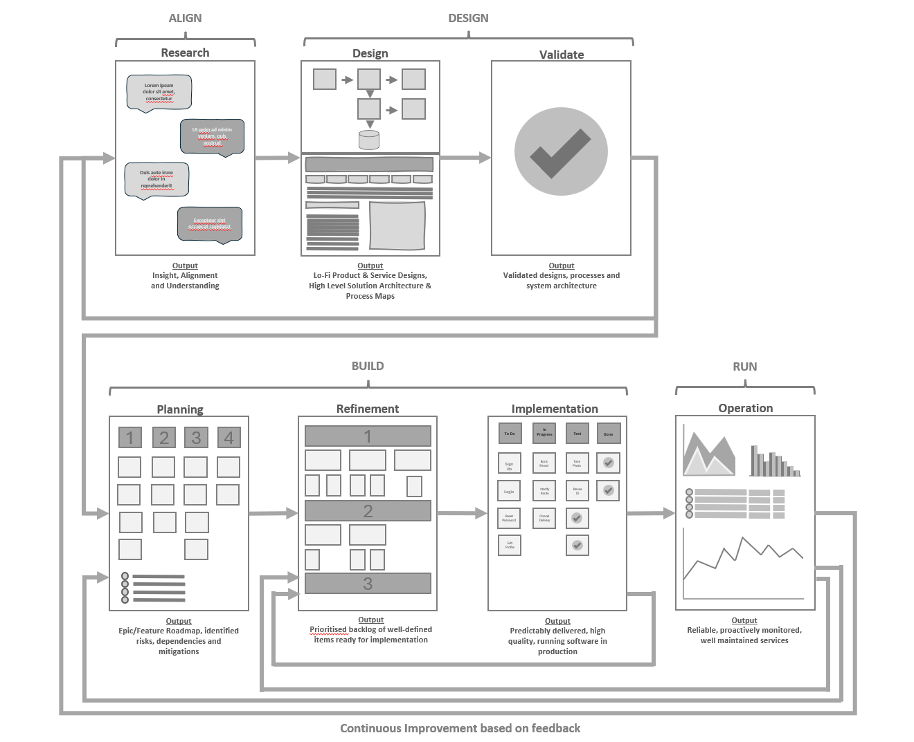

# Default Delivery Process Overview

<!-- Scrap 'Default' - Default implies lack of thought.  I think we can use a better word, or drop it -->

## Introduction
At Burendo, we aim to deliver high quality solutions that create real business and user impact. To do this well, we need consistent and effective ways of working that guide our teams on what to do and how best to do it.
<!-- 'we need' implies we lack it.  reword this.  Should come from a position of confidence -->

The Burendo Default Delivery Process sets out how we prefer to work when a customer does not have a strongly defined approach. It is not a rigid framework, but a practical blend of proven ways of working that help us deliver successfully.
<!-- I think we can call out reduced TTV, onboarding, ramp up.  These are important internally and externally.  If we anchor everything against perceived value, it's easy to get behind it -->
<!-- It is not a rigid... Let's not defend out position.  Attack instead.   -->

We always align with our customers' ways of working while offering our best professional advice on how they can improve their approach. There is no single right way to deliver solutions. What matters is staying flexible, practical, and adapting to the needs of the project while maintaining our core principles of agility, collaboration, accountability, and a commitment to quality.
<!-- words like project make me itchy.  Alongside this we should produce, stick to and socialise a standard glossary of terms. It's not to make everyone sound the same, but it improves communication (up/down/in/out) if we all mean the same thing. -->

The process outlined here covers everything needed to take an idea from initial exploration through to design, validation, implementation, and live operation. Ensuring ongoing value and continuous improvement.

To make it easy to follow, we have broken the process into key areas. These are not rigid phases. Everything is iterative, concurrent, and collaborative. Everyone in the team plays a role in each stage, and work moves fluidly through them as needed to get the job done well.
<!-- Blend this into the Four D's  -->

 
<!-- replace this image with an updated version of the Burendo SDLC, with more detail. -->

## What This Guide Is (and What It Is Not)
*Spoiler* it's not a guide.  It is not a rigid process that must be followed to the letter.  There is no cheat sheet, or IFTTT flow to follow.  It's a collection of hard-won experience, industry knowledge, and practical insight. It gives teams a solid foundation to establish effective ways of working quickly, saving time and helping them get productive faster.
<!-- It's not a guide.  Guides imply you ca follow it. It's curated information.  Pieces of a jigsaw that the reader may require multiple or only one piece etc. -->

Consistency matters, but that does not mean strict conformity. Teams are encouraged to adapt and refine these practices to fit their situation. If you are unsure where to start, following this guide will give you a great head start in delivering high quality solutions.
<!-- Again anchoring against value here is important. Certainty - Up.  TTV & Cost - Down -->

In many cases, teams may not have complete freedom to shape their delivery process. When that happens, this guide can help frame discussions with customers, providing a way to suggest improvements and explain their benefits.
<!-- swap out guide for something else.  Maybe we need to agree what this is. -->

These are a collection of living documents that evolve over time with input from everyone. If something does not feel right or could be improved, we encourage you to contribute ideas and help make it better.

## Why This Guide Exists
Autonomy has always been central to how we work, and that remains the case. Teams should have the freedom to shape their ways of working to suit their engagement. But autonomy does not mean starting from scratch every time. Without a solid foundation, teams can waste time reinventing basic processes instead of focusing on what really matters.

This guide provides that foundation. It is not something to follow blindly, but a starting point that helps teams get up and running quickly. It allows them to build on proven ways of working, applying their own judgement to adapt where needed, rather than spending time solving problems that have already been solved.

Across our engagements, we see a lot of variety in how teams work. Some of that is healthy. Delivery should be tailored to the needs of the customer and the situation. But not all variation is valuable. Sometimes, teams deviate from best practices without good reason, leading to inefficiencies or avoidable problems. Our aim is to encourage well-informed decisions, helping teams focus on where customisation adds real value while sticking to established approaches that are known to work well.

<!-- We should pick a tone of voice, and POV and stick to it throughout. This is all externally facing content. -->

This guide is also for teams who want to refine how they work. By comparing their current approach with these shared defaults, they can assess what is working well and where improvements could be made. In doing so, we can continue to strengthen our delivery, helping teams move faster and more reliably without compromising on quality.
<!-- It's also for our clients. -->
