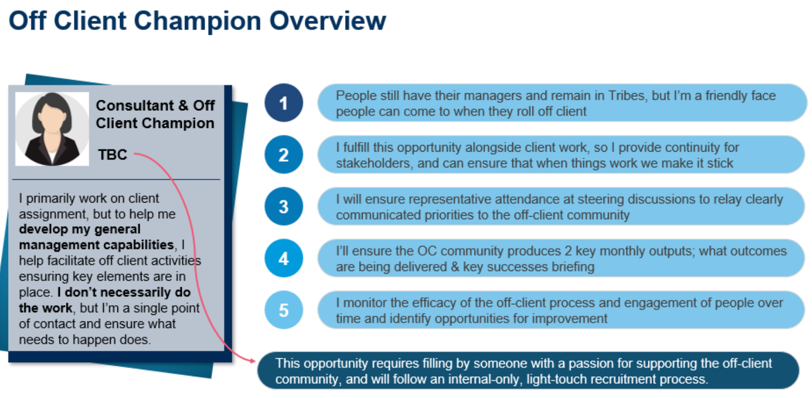

# The OC

Burendo colleagues who are off or between client engagements are encouraged to take the lead with achieving our Missions; from improving how and where we work, to identifying and implementing value-add opportunities, and everything in between. The OC aims to provide the structure and support to do this in a collaborative community setting.

## The OC Champion

In order to help the OC work well together, we have a role called OC Champion of which their is one. 

The OC Champion is a hat people wear and we incentivise it by it helping Burendoers towards your career growth at Burendo by taking on extra responsibilities (along with the intrinsic motivation some people have for responsibilities like this).

### Responsibilities

The OC role champion profile can be seen below:

