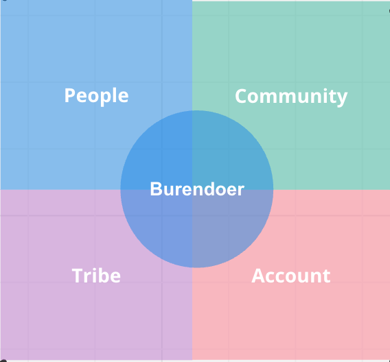

# Support Network Introduction

One of our core values at Burendo is "**People showing they care**" and as part of this it's important to us that our Burendoers have a strong support network around them at all times.

The people support network for Burendoers is comprised of four areas - People, Community, Tribe and Account with Burendoers at the heart of it all.

The reason Burendoers are at the centre is because at Burendo we want every individual to have control of their own career. The four areas of support are there to help them with this and support them - each Burendoer can make as much use of them as they need or want to.
