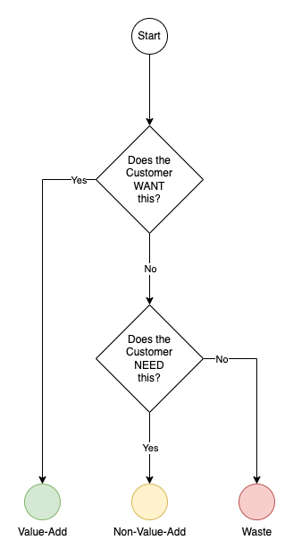

# Lean Value

In this article we show the concept of `value-add` within Lean Manufacturing and how it helps us to classify and prioritise our development roadmap by introducing the concept of classifying each of our day-to-day activities into the following definitions:

* Value Add
* Non-Value Add
* Waste

## Classifications

In the very simplest of terms it's about understanding what the customer WANTS & NEEDS.

### Value Add

Value-Add activities can be defined as those that a **customer is willing to pay for**.

If we were to look at a standard e-commerce site then we could identify the following as some of the value-add.

1. Content Management System
1. Product Search Page
1. Product Details Page
1. Checkout Process
1. Package Tracker
1. Chatbot
1. 1-click purchasing
1. Sales dashboard
1. Branding

It's quite easy to see how each of the examples above is something that a client would be interested in.  They all demonstrate clear value to the customer.

### Non-Value Add

Non-Value add activities can be defined as those that a **customer is NOT willing to pay for**.

If we were to look at a standard e-commerce site then we could identify the following as some of the non-value add.

1. User Registration
1. Login Page
1. Forgotten Password
1. Cookie Popup
1. Database Creation Script
1. WAF/CDN
1. Training
1. Project Management ( Sorry PMO! :D )
1. Sprint Planning
1. Code Reviews
1. Accessibility

Now we've moved into different territory.  All of the activities above will be necessary for the project to be completed successfully, but these are not the things the customer have come to us to do.  No customer has ever asked for a Forgotten Password or for code to be Peer Reviewed, but we all know that both would be necessary.  There may also be activities that they have willingly accepted (such as Accessibility or PMO updates) but again, these do not meet the core activities of the site, which is about selling.

### Waste

Waste are actually Non-Value Add activities, but are actively detremental to the project.

If we were to look at a standard e-commercy site then we could identify the following as some waste.

1. Communication Delays
1. Tickets sitting idle in queues
1. Moving goalposts
1. Bugs
1. Design Flaws
1. Technical Debt
1. Acting with a Lack of Knowledge
1. Working on the wrong priorities

It should be easy to see how each of the issues are waste.

## What do we do?

Given that we understand that what these classifications exist, how should we handle them?

### Value-Add

This is where we should be spending our time and effort, as it is justified by the customer's willingness to pay for us.  If we spend the majority of our time doing Value-Add then the end result should be a delighted customer.

### Non-Value Add

We can cascade through the following stages and exit at the earliest one.

1. Is this (or has it become) Waste?
1. Can we minimise doing this? (e.g. Buy don't Build)
1. Is there a "Standard and Repeatable" pattern/process to follow?
1. Should we create a Standard and Repeatable pattern/process?

If we've passed through all those steps then this is an ad-hoc piece of value-add work, which should be completed in a timely fashion.  Note that failure to address it in a timely fashion will introduce Waste, such as Technical Debt and longer Backlog Grooming sessions.

### Waste

Simple.  Identify and eliminate them.

In practice this could be harder to achieve.  A customer who keeps changing their mind or doesn't respond to emails quickly will need effective management.  Bugs may be recurring because of faulty software or a failure to learn lessons from the past.

Therefore we need to be constantly on the lookout for Waste, and address it as it occurs.  We should also be challenging all Non-Value Add activities to understand when they will become Waste.  (Do we still need this meeting?  Are we spending too much effort on Peer Reviews?)

## Summary

Look at each activity we undertake and the software it produces and learn to classify them as Value-Add, Non-Value-Add and Waste, as it helps us understand and address them.
