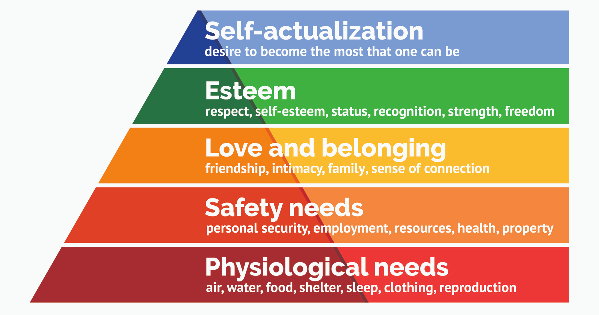
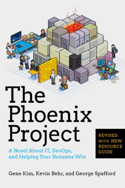
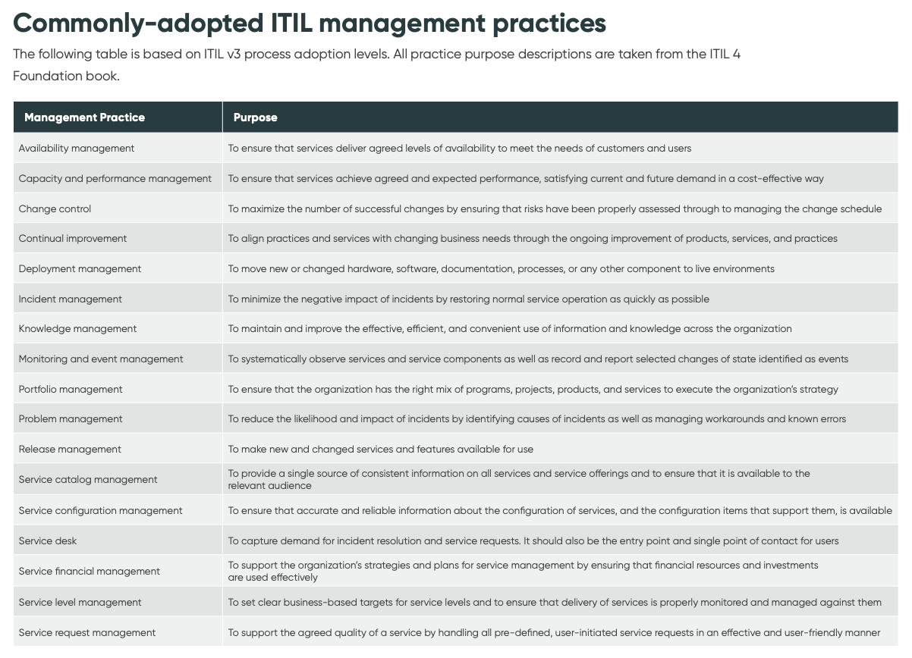

# Delivery Foundations

The [What is a Delivery Manager?](../../Our%20People/Roles/Role%20Profiles/agile-delivery-lead.md) page will give you an overview of the role. But what about the core knowledge for successful delivery? These are some of the starting points and fundamental things to know:

## Agile ways of working

### Scrum

Mike Cohn is a strong recommendation from our own experiences of onboarding to Agile ways of working, and learning Scrum is a good starting point. Scrum is very well established (some may say too much!) due to it’s well-structured, comprehensive framework:

[Introduction to Scrum PPT - Scrum Methodology](https://www.mountaingoatsoftware.com/presentations/an-introduction-to-scrum)

Want to learn Scrum methodology from expert Mike Cohn? Download and share this introduction to Scrum PPT by Mountain Goat Software in several languages.

### Lean
[The Toyota Way](https://www.amazon.co.uk/Toyota-Way-Management-Principles-Manufacturer/dp/0071392319) (Toyota Production System) is a baseline to a lot of the Agile and Lean movements, in particular with the introduction of concepts including:

- [Kanban](https://en.wikipedia.org/wiki/Kanban) used widely as a Lean/Agile workflow management system 

- [Kaizen](https://en.wikipedia.org/wiki/Kaizen) as the basis of Continuous Improvement

It is born from the manufacturing industry (so keep this in mind!), and is a good thing to understand, as it has led to many modern Agile working practices.

## Leading people effectively

### Motivation

A considerable part of working within Delivery roles is being able to build successful teams, and understanding what motivates individuals is key to that. 

Maslow’s pyramid of needs is a good fundamental starting point:

It shows how there are many facets to what people respond to or their needs from the things they do. It disrupted well-established, at-the-time thinking that money was a key motivating factor. It doesn’t necessarily dispute that, but it provides extra depth as to why, or why not!

 

To delve further into this, Drive by Daniel Pink is essential reading - it explains in more detail what creates motivation for individuals in certain circumstances:  

### Delivery Support

Delivery roles are varied and in a significant amount of cases not clearly defined. There may be certain reasons for this, but you may find that often, working in conjunction with a product-orientated role such as a Product Owner, the Delivery Manager or Lead will have a responsibility over the more “technical” aspects of the product or system.

### DevOps

DevOps is widely established and still growing as the modern-day approach to building products and systems effectively. It combines many different elements (including some of the above), along with a robust, well-supported and ever-growing set of technical working practices. These practices are intended to create the most effective responses to user needs through technological solutions. For any engineers or development team members, DevOps could be considered as “bringing them closer to the delivery of user value”, and has a strong intention to learn from past mistakes that have often been exacerbated by waterfall methods of working.

GitHub and GitLab are flag bearers of the DevOps movement and provide a [Beginner's Guide to DevOps](https://page.gitlab.com/resources-ebook-beginners-guide-devops.html?utm_medium=cpc&utm_source=google&utm_campaign=devopsgtm_emea_pr_rsa_nb_exact_&utm_content=guide-to-devops_digital_x-pr_english_&&utm_term=what%20is%20devops&_bt=603958011799&_bk=what%20is%20devops&_bm=e&_bn=g&_bg=83240379728&gclid=CjwKCAiA2fmdBhBpEiwA4CcHzZHENEa4QNi1uUt4ZU6xcNrQz51ehUWkjFLuC0dM7PAI8PUHEBlvLBoCwpEQAvD_BwE) here.

For a different but wholly insightful way of learning about DevOps, the Phoenix Project is highly recommended to show the many, and unfortunately typical, problems that an effective DevOps approach can help solve:  

### ITIL

A good way of understanding what is involved in the internally-facing, technically-facing responsibilities this may include is to look to ITIL:

>Information technology infrastructure library (ITIL) is a series of practices in IT Service Management (ITSM) for aligning operations and services.

It has a deep grounding in IT systems management and is well-established in larger, more corporate-level technology practices.

From the latest version, here is what ITIL considers the more commonly adopted practices:

There are many, many sources of ITIL-based knowledge. It is owned by AXELOS, a joint venture between Capita and the UK Cabinet Office, but many businesses and training courses have been built upon this framework (it is an industry in and of itself). The certified ITIL training courses are probably the best 
