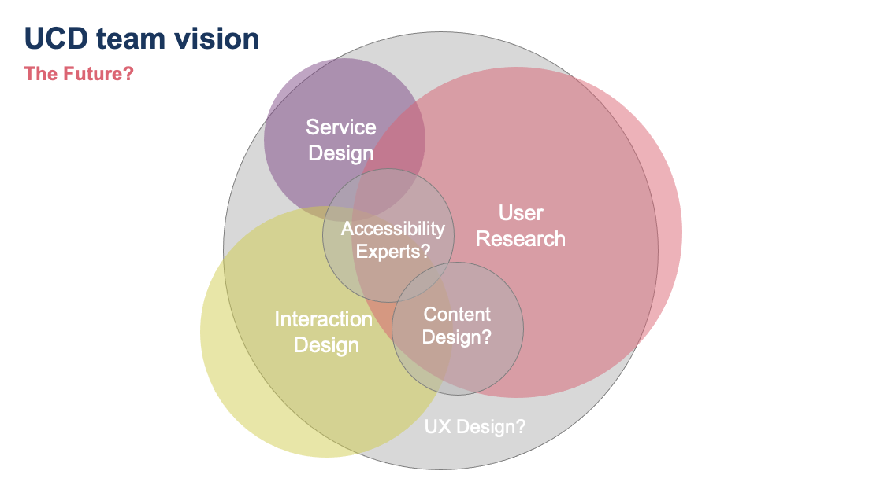

# User Centred Design

### Key roles  

There are a number of key roles that exist when being user-centred; this is by no means an exhaustive list, but hopefully illustrates some of the differences between them, and how they all link together.

  

  

- [User Researcher](../../Our%20People/Roles/Role%20Profiles/ur-ucd.md)
- [Service Designer](../../Our%20People/Roles/Role%20Profiles/sd-ucd.md)
- [Interaction Designer](../../Our%20People/Roles/Role%20Profiles/id-ucd.md)
- [Accessibility Specialist](../../Our%20People/Roles/Role%20Profiles/as-ucd.md)
- [Content Designer](../../Our%20People/Roles/Role%20Profiles/cd-ucd.md)