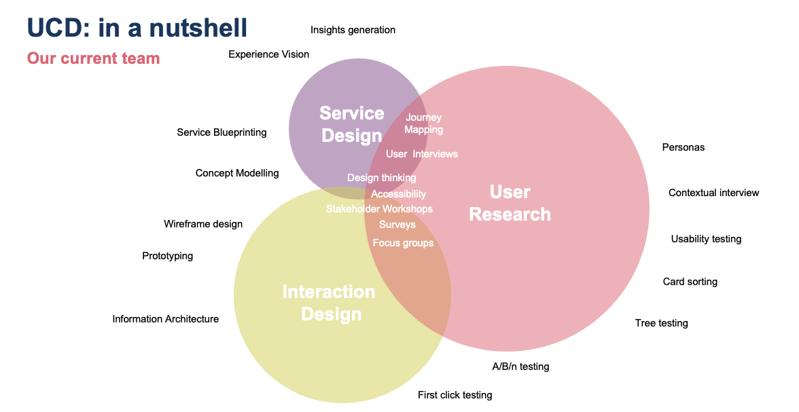

# User Centred Design Practice

This section contains all the details on the UCD Community of Practice(CoP), links to the tools, ways or working and processes we have created or we use.

## Practice Details

### Who we are  

We are a community of Burendoers with a common interest creating better experiences for people; whether through practical application, theory, or an interest in how ucd works with other practices within the business.

### Key roles  

There are a number of key roles that exist when being user-centred; this is by no means an exhaustive list, but hopefully illustrates some of the differences between them, and how they all link together.

  

  

- [User Researcher](Roles/ur-ucd.md)
- [Service Designer](Roles/sd-ucd.md)
- [Interaction Designer](Roles/id-ucd.md)
- [Accessibility Specialist](Roles/as-ucd.md)
- [Content Designer](Roles/cd-ucd.md)  

### Regular Meetings  

All our meetings are captured in the practice calendar. As a Burendoer, you can join the calendar, or find links to the meetings following the bookmarked links from the `#cop-ucd` channel on Slack.

- Monthly COP meetup.
  - Held on the first week of every month.
  - Open forum format, with space for an agenda if required
  - We all attend in person where possible

### Slack

The `#cop-ucd` channel on Slack is our main platform for communication, outside of any face to face meetings.  This will be the place to share and get the latest information or ask questions and get the most prompt response.

### Work backlog (JIRA)  

- Our work is traditionally captured and managed in JIRA tickets.  
- Through JIRA, we manage our backlog of work, as well as current work in flight.  
- We tend to work in a Kanban style, as most work is undertaken ad-hoc.  Short time boxes, such as sprints, would not suit our ability to deliver.
