# Contributor guide

One of the founding principles of [The Burendo Handbook](intro.md) is that it is open to anyone to contribute. We try to make the process as simple as possible to do this, while still keeping some form of quality control on the contributions.

## Contributions from outside Burendo

We welcome contributions in certains areas from outside of Burendo. As the purpose of the Handbook is to be the voice of the Burendoers, most of the content comes from inside the company, however for any mistakes you spot, please feel free to fork the [public content repo](https://github.com/BurendoUK/burendo-handbook-public) and raise a Pull Request for us to review.

The rest of this guide will concentrate on **contributions from inside Burendo**.

## Create a GitHub account

If you have not done this already you need to create yourself a GitHub account. In order to do this go to [GitHub's website](https://github.com/), click *"Sign Up"* and create a new account. We would recommend turning on 2FA for the account.

### Request access for public content

In order to get access to add public content:

1. Go to Burendo slack and join the `#cop-engineering` channel
1. Put a shout out with a `@here` for access to contribute to the **public** section of the Handbook and include your GitHub username
1. One of the engineering CoP will pick this up and let you know when done
1. You will get an email invitation to the email associated with your GitHub user - make sure to accept this invitation

> *Note*: Once you have access to contribute to the public content, it stays with you while at Burendo, you do **not** need to request public contributor access every time

### Request access for private content

Contributions to the private content needs temporary access granted - the reason for this is that it costs to give access for private repositories. In many ways the process is the same for the contributor though:

1. Go to Burendo slack and join the `#cop-engineering` channel
1. Put a shout out with a `@here` for access to contribute to the **private** section of the Handbook and include your GitHub username
1. One of the engineering CoP will pick this uip and let you know when done
1. You will get an email invitation to the email associated with your GitHub user - make sure to accept this invitation
1. **Importantly**, when you are finished contributing and your contribution is live in the published Handbook, you must put another shout out with a `@here` on `#cop-engineering` with your GitHub username stating you no longer need access

## Making changes

Once you have access, you can make and submit your changes. If you are code-savvy, then feel free to do the below in code and clone the repositories, but this guide will use the browser to make the changes as that opens the Handbook up better to contributions from anyone in the business.

To make changes, you need to open the [public](https://github.com/BurendoUK/burendo-handbook-public) or [private](https://github.com/BurendoUK/burendo-handbook-private) repository in your browser, according to what you need to access.

## Create a new branch

The first thing to do is to create a `branch` for making your changes on. To do this, click the highlighted button from the repository in the browser:

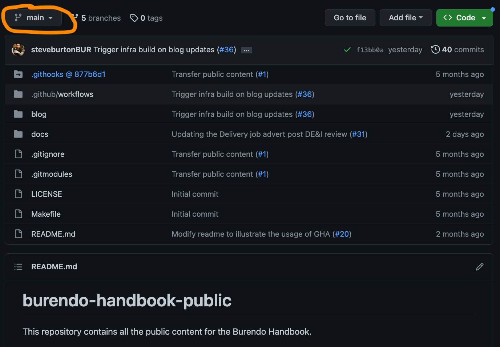

If you have previously created a branch and you are coming back to complete your changes, type the name here and click the branch to select it.

If you haven't yet created a branch for this contribution, then type the name here you want and click "create branch". A suggested naming convention for the branch is `name-purpose` so for example for this guide I created a test branch like this:

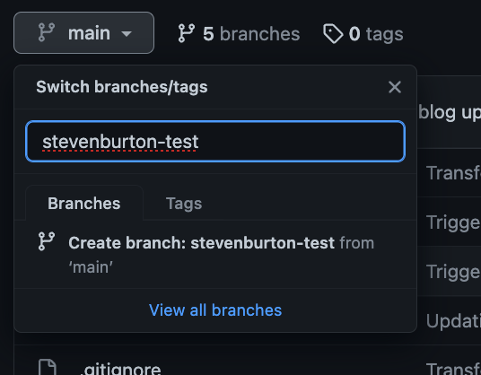

Once you have created or selected your branch, you will see it selected in the drop down. You can now make all your contributions.

## Create a new document

To create a new document, first enter the `docs` folder in the folder structure:

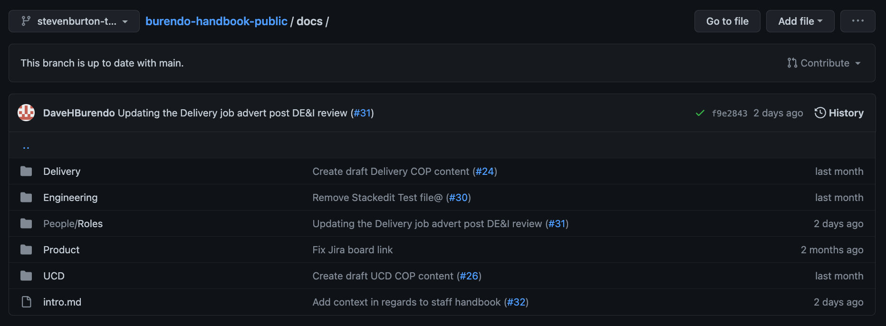

The docs you see here match the docs in the [live handbook](https://handbook.burendo.com/). You will see the folder structure matches the sidebar automatically. Once in the docs folder, click the "Add file" drop down top right and select "Create new file". You will get a page similar to this:

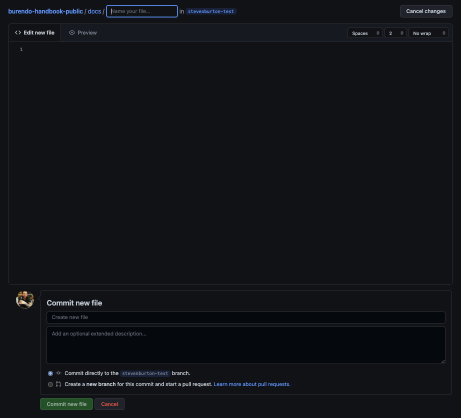

Enter the new file name at the top - the name doesn't matter too much, so just make it logical and ensure it is all lowercas and **ensure the file name ends in `.md`**. You can't create new folders directly, so if you want your file in a new folder add it as part of the file name - for example, `subfolder/file.md`.

You may now write your new document - see the section [on markdown and submitting changes](#write-your-document-and-submit-changes)

## Open a document for edit

To open a document for edit, again enter the `docs` folder in the folder structure, find the file you wish to edit (remember the file structure == the menu structure in the Handbook) and click on it to open it. You will see the file open to edit, like below when I have opened the `intro.md` file:

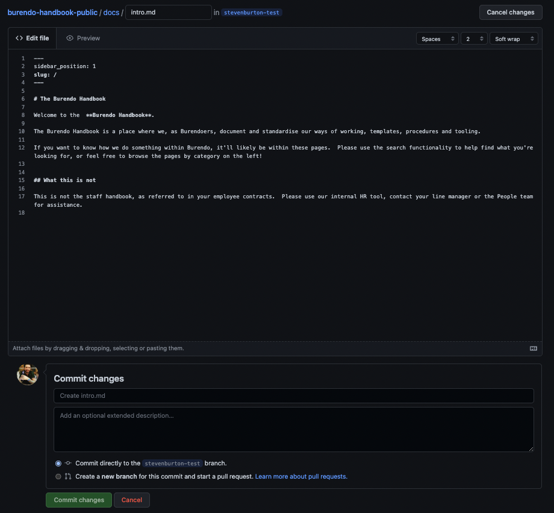

You may now edit the document so click the pencil icon to edit the document and then see the section [on markdown and submitting changes](#write-your-document-and-submit-changes).

## Write your document and submit changes

Documents are written in a language called "Markdown". Markdown is quite simply and not much different from writing in Confluence or similar. This guide doesn't deal with Markdown directly as there are many guides on the internet and [this](https://www.markdownguide.org/cheat-sheet/) is a handy cheat sheet I use a lot.

One of the areas people struggle with in Markdown is tables - one way is to use a handy [markdown table generator](https://www.tablesgenerator.com/markdown_tables) where you can create your table visually and then copy the Markdown code to clipboard and paste it in to your page.

Click the "Preview" button on the edit page to view what your page will look like when published, which gives you a view similar to this for the intro page:

Once you have made all the changes you wish to in your new or existing document, you can submit them as completed. This doesn't make them live yet so don't worry! In the "Commit changes" dialog, simply fill in the first box with a summary of the changes and then add a description. Leave the `Commit directly to the xxxxx branch.` option selected and click "Commit changes"! For instance here is my commit message for my changes to `intro.md`:

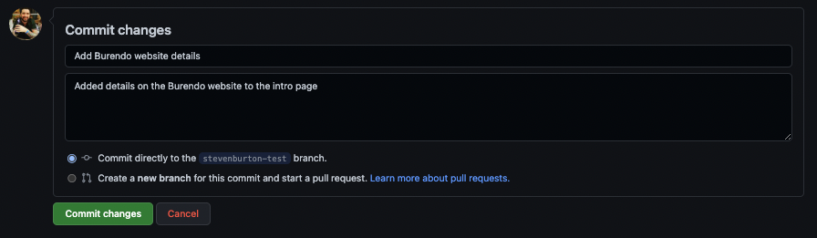

You may create more pages and/or edit more existing pages as you wish to for this contribution. Just ensure that on each one, you commit changes when done! You may also go back to your pages you have already created and edited and update them again if needed. The process is exactly the same as above.

When you have finished your contribution, you need to [submit it for review](#submit-your-changes-for-review).

## Create a new blog

If your contribution is a blog, then the process is very similar to documents, but slightly different. To create a new blog, first enter the `blogs` folder in the folder structure:

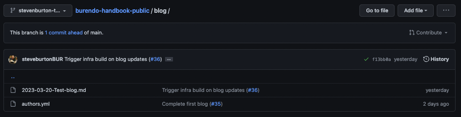

You will then need to edit the `authors.yml` file. Click the file to edit it, which will show similar to below:

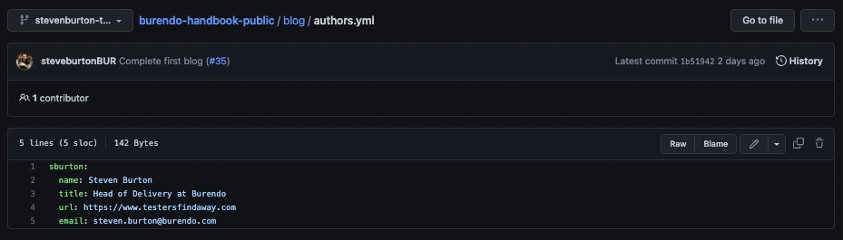

Click the pencil icon to edit the file to show the below:

You don't need to worry about the language or syntax here because all you need to do is copy and paste a block (i.e. copy and paste the `sburton` block with everything below is that is **indented**). Then change `sburton` on the pasted block to your initial and surname in lowercase and edit the details for the new block to match your details.

Once you have made the changes to this file, you can submit them as completed. This doesn't make them live yet so don't worry! In the "Commit changes" dialog, simply fill in the first box with a summary of the changes and then add a description. Leave the `Commit directly to the xxxxx branch.` option selected and click "Commit changes"!

Now you will create your blog. This is the easiest way to do this:

- Open the last blog that is in the folder (i.e. the last one that starts with a date as a file name) to show something similar to below:

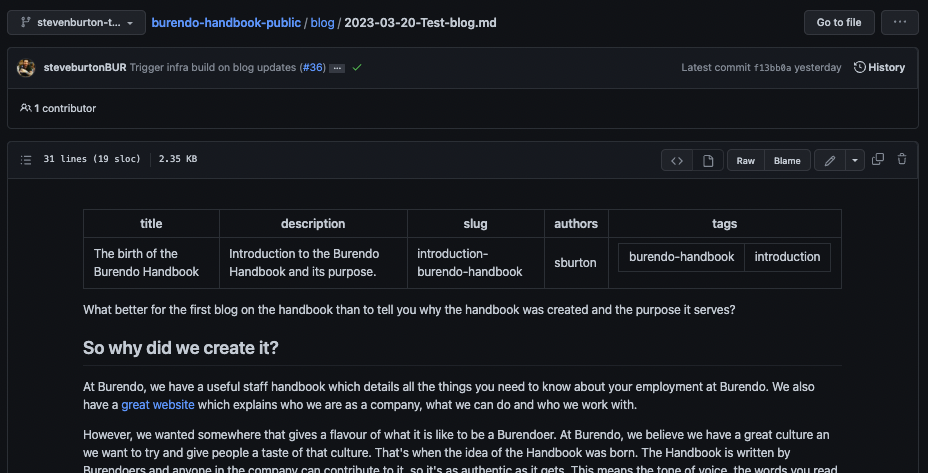

- Click "Raw" to open the file in its raw data form
- Copy the test at the top inbetween the lines with `---` on
- Click back on the browser
- Go back to the `blog` folder
- Click "Add file" and select "Create new file" from the drop down to show a screen similar to below:

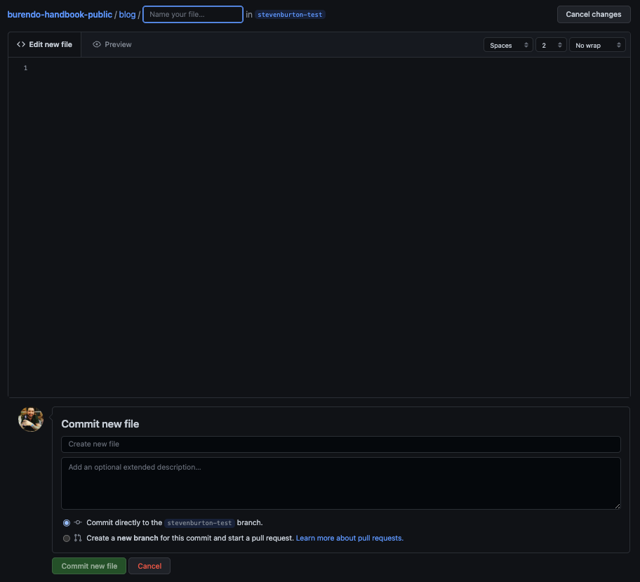

- Enter a file name with the following format: `YYYY-MM-DD-Name-of-blog.md`
- Write your blog - see the section [on markdown and submitting changes](#write-your-document-and-submit-changes)

When you have finished your contribution, you need to [submit it for review](#submit-your-changes-for-review).

## Submit your changes for review

Now that all your changes are done, you can submit them for review! To do this, go to the route folder - the easiest way is to click on `burendo-handbook-public` on the breadcrumbs which appear on all pages like this:

From here, you will see a page similar to below. Note the new green button at the top right:

Click the big green button that says `Compare & pull request` and you will be taken to a screen similar to this:

If you have only changed one file it's likely everything is filled in for you, like I have here. If not, then enter a title for the contribution, summing it up is the first text box and then describe all the changes in the bigger text box. When happy click on `Create pull request` to show a screen similar to below:

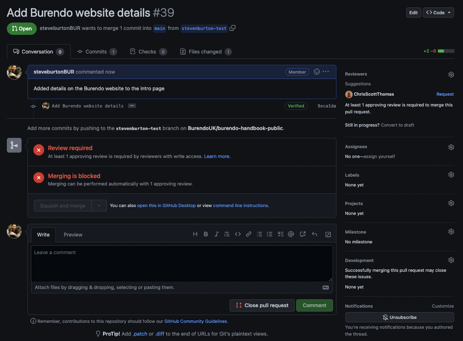

Now all you need to do is copy the URL to this page, go to the `#cop-engineering` channel in slack and post a message similar to below:

> `@here [URL] -> [Summary of contribution]`

Someone from the CoP will pick up the pull request and review it. The review process is not covered here because the CoP member who picks it up will work with you on this and have calls and screen shares where necessary. Often the review process needs no changes and your contribution is complete! When the review is complete, the CoP member will merge your pull request and it will be live about 5 minutes later.

## After your contribution

Now you can spread the word and encourage others to contribute! If this guide needs updating please either make another contribution to update it or contact the engineering CoP and let them know which bit was wrong or the areas you found most difficult to use. Your feedback is important in making this Handbook as easy to contribute to as possible.
