# Contributor guide

One of the founding principles of [The Burendo Handbook](intro.md) is that it is open to anyone to contribute. We try to make the process as simple as possible to do this, while still keeping some form of quality control on the contributions. We welcome contributions in certains areas from outside of Burendo. As the purpose of the Handbook is to be the voice of the Burendoers, most of the content comes from inside the company, however for any mistakes you spot, please feel free to fork the [public content repo](https://github.com/BurendoUK/burendo-handbook-public) and raise a Pull Request for us to review. The rest of this guide will concentrate on **contributions from inside Burendo**.

This guide is structured as below:

1. [Common actions](#common-actions) - the actions you need to perform to make _any_ changes
1. [Specific actions](#specific-actions) - the actions you need to perform to add different types of changes (i.e. blog, new documents, editing documents)
    - [Create a new document](#create-a-new-document) - create a new page in the Handbook.
    - [Edit an existing document](#edit-an-existing-document) - edit a page that currently exists in the Handbook.
    - [Create a new blog](#create-a-new-blog) - create a new blog entry on the Handbook.
1. [Write your contribution](#write-your-contribution-and-submit-changes) - add your contribution text using markdown syntax
    - [Saving your work](#saving-your-work) - how to save your work for later or finalisation.
    - [Making further changes](#making-further-changes) - coming back to previously saved work.
    - [All changes committed](#all-changes-committed) - when all work is finished and saved.
    - [Adding images](#adding-images) - add an image and use it in your page or blog.
1. [Finalise your contribution](#finalise-your-contribution) - the actions you need to do to get your contribution live

&nbsp; <!-- Adds a new line  -->
## Common actions

The below actions will need to be done in order to make any contributions to the Handbook. Some things are one-time only so if you have contributed before, you can skip these steps.

&nbsp; <!-- Adds a new line  -->
### Create a GitHub account (one-time)

If you have not done this before you need to create yourself a GitHub account. In order to do this go to [GitHub's website](https://github.com/), click *"Sign Up"* and create a new account. You will need to use 2FA for the account and can set up now or will be prompted to later.

&nbsp; <!-- Adds a new line  -->
### Request access for content changes (one-time)

In order to get access to add or edit content:

1. Go to Burendo slack and join the `#practice-engineering` channel
1. Put a shout out with a `@here` for access to contribute to the **public** section of the Handbook and include your GitHub username
1. One of the engineering practice will pick this up and let you know when done
1. You will get an email invitation to the email associated with your GitHub user - make sure to accept this invitation

> *Note*: Once you have access to contribute to the public content, it stays with you while at Burendo, you do **not** need to request public contributor access every time

&nbsp; <!-- Adds a new line  -->
### Browse to code

Once you have access, you can make and submit your changes. If you are code-savvy, then feel free to do the below in code and clone the repositories, but the rest of this guide will use the browser to make the changes as that opens the Handbook up better to contributions from anyone in the business. To make changes any changes without using the code, you need to open the [content](https://github.com/BurendoUK/burendo-handbook-public) repository in your browser.

&nbsp; <!-- Adds a new line  -->
### Create a new branch

The first thing to do is to create a `branch` for making your changes on. To do this, click the highlighted button from the repository in the browser:

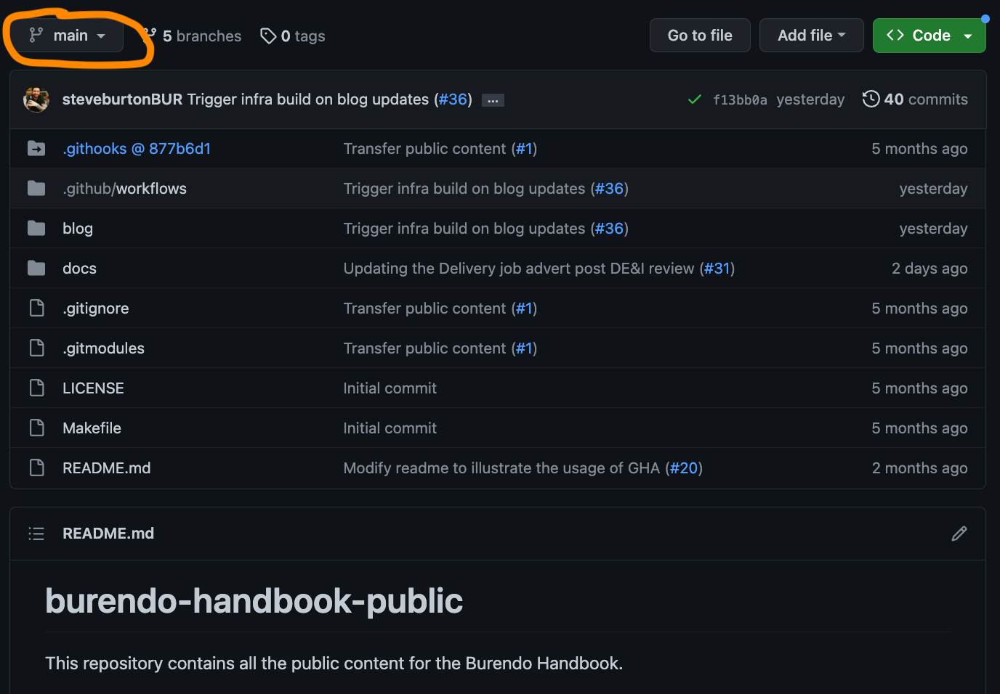

If you have previously created a branch and you are coming back to complete your changes, type the name here and click the branch to select it.

If you haven't yet created a branch for this contribution, then type the name here you want and click "create branch". A suggested naming convention for the branch is `name-purpose` so for example for this guide I created a test branch like this:


Once you have created or selected your branch, you will see it selected in the drop down. You can now make all your contributions.

&nbsp; <!-- Adds a new line  -->
### The menu

Before you start, it's important to understand how the menu works. The things to know about the sidebar menu in the Handbook are:

- The menu is auto generated from the documents in the `docs` folders
- The document's title is used for the menu item text _or_ the document's file name is no title is present (the guide shows you how to add a title)
- Folders will create menu items which have sub-menu items that are the sub-folders or documents within that folder - i.e. _the folder hierarchy == the menu hierarchy_

&nbsp; <!-- Adds a new line  -->
## Specific actions

Now you will need to select the type of contribution you wish to make and follow those instructions. You might be making multiple contributions in one go, in which case make all your contributions first, following the relevant instructions in this section and then go to [finalise your contribution](#finalise-your-contribution). The contribution types you can make are:

1. [Create a new document](#create-a-new-document) - create a new page for the Handbook.
1. [Edit an existing document](#edit-an-existing-document) - edit a page that currently exists in the Handbook.
1. [Create a new blog](#create-a-new-blog) - create a new blog entry on the Handbook.

&nbsp; <!-- Adds a new line  -->
## Create a new document

To create a new document, first enter the `docs` folder in the folder structure:

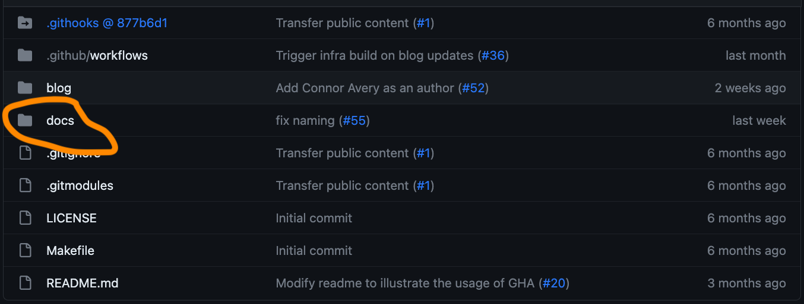

You will then see the docs folder opened which will reveal two menu folders:

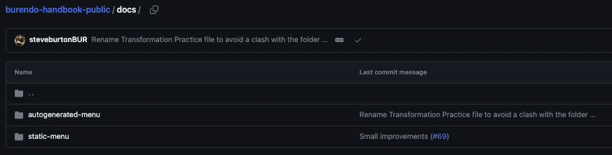

Then you will need the `autogenerated-menu` folder so click in here and it will look something like the below image but folders may be different as content changes over time:

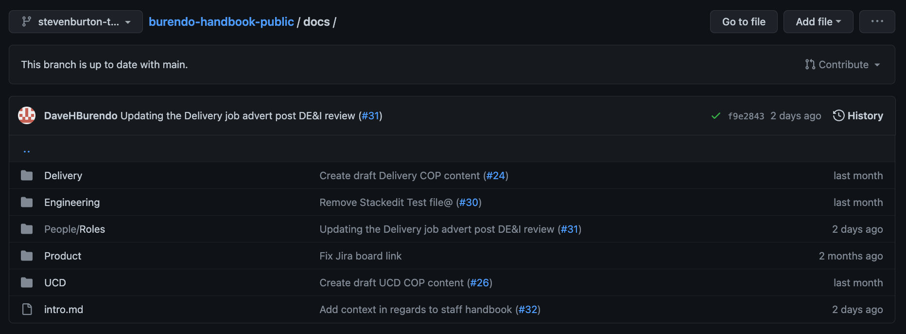

The docs you see here match the docs in the [live handbook](https://handbook.burendo.com/). You will see the folder structure matches the sidebar automatically (with the exception of the home page and this contribution guide). Now select the options that matches what you want to do:

1. [Create a new document in a new folder](#create-a-new-document-in-a-new-folder) - create a new section in the main Handbook menu with a new page under it.
1. [Create a new document in an existing folder](#create-a-new-document-in-an-existing-folder) - create a new page on the Handbook.

&nbsp; <!-- Adds a new line  -->
### Create a new document in a new folder

You don't add the sub-folder by itself, it is added in the same step as adding the new document, so once you in the relevant parent folder where you would like to add the sub-folder, click the `Add file` drop down top right and select `Create new file`. You will get a page similar to this:

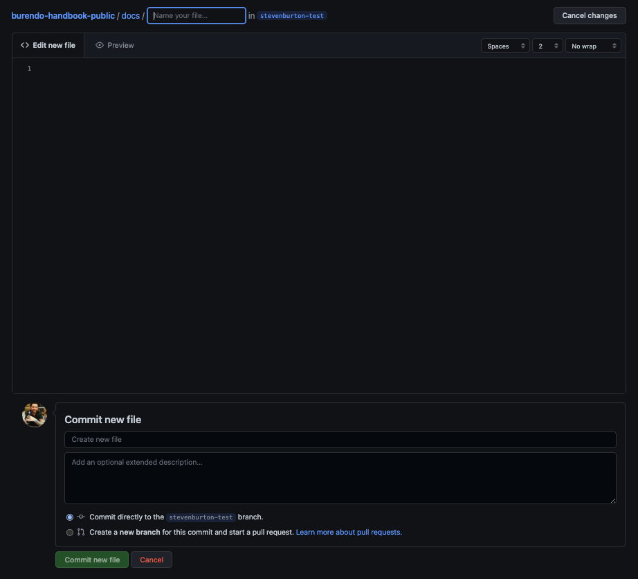

Enter the new file name at the top - the name doesn't matter too much, so just make it logical and ensure it is **all lowercase and the file name ends in `.md`**. The file name should _include_ any sub-folders you wish to create - i.e. `Sub Folder 1/Sub Folder2/file.md` - the name of the sub folder will match the name of the menu item so be aware of capitalisation and spelling.

**NOTE**: You should not use the following characters in folder or file names: `?`, `[`, `]`, `(` or `)`.

You now need to add a [document title](#document-title).

&nbsp; <!-- Adds a new line  -->
### Create a new document in an existing folder

Browse to the folder you wish to add the new document in (hint remember the folders match the menu, this will help you find the right folder) and then click the `Add file` drop down top right and select `Create new file`. You will get a page similar to this:


Enter the new file name at the top - the name doesn't matter too much, so just make it logical and ensure it is **all lowercase and the file name ends in `.md`** - i.e. `file.md`.

**NOTE**: You should not use the following characters in folder or file names: `?`, `[`, `]`, `(` or `)`.

You now need to add a [document title](#document-title).

&nbsp; <!-- Adds a new line  -->
### Document title

All new documents should start with the below text:

> `# Title of Document`

The text that comes after the hash and space will be the text used **in the sidebar menu** for your document, so it is important it is sensible and capitalised. All existing pages should have this already (use them as examples if needed).

**NOTE**: You should not use the following characters in the title: `?`, `[`, `]`, `(` or `)`.

You may now write your new document - see the section on [markdown and submitting changes](#write-your-contribution-and-submit-changes)

&nbsp; <!-- Adds a new line  -->
## Edit an existing document

To open a document for edit, again enter the `docs` folder in the folder structure, find the file you wish to edit (remember the file structure == the menu structure in the Handbook) and click on it to open it. You will see the file open to edit, like below when I have opened the `intro.md` file:

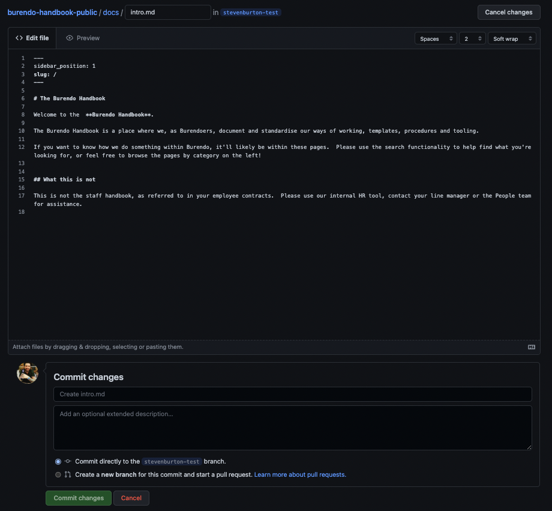

You may now edit the document so click the pencil icon to edit the document and then see the section [on markdown and submitting changes](#write-your-contribution-and-submit-changes).

&nbsp; <!-- Adds a new line  -->
## Create a new blog

If your contribution is a blog, then the process is very similar to documents, but slightly different. To create a new blog, first enter the `blogs` folder in the folder structure:

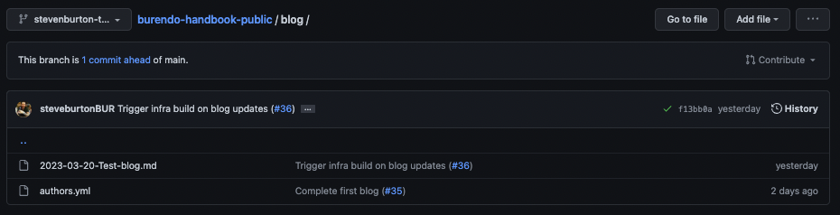

&nbsp; <!-- Adds a new line  -->
### Add yourself as an author

If this is your first blog in the Handbook, you will then need to add yourself as an author, which involves two steps:

1. [Add your author picture](#add-author-picture)
1. [Update the `authors` file](#edit-authors-file)

&nbsp; <!-- Adds a new line  -->
#### Add author picture

To add an author picture, find a head shot of yourself, name it `initialsurname.png` similar to `sburton.png`, then go to Slack in the `#practice-engineering` channel and post that you wish to add your author pic and one of the practice will pick this up for you.

&nbsp; <!-- Adds a new line  -->
#### Edit authors file

To edit the authors file, click the `authors.yml` file, which will show similar to below:


Click the pencil icon to edit the file to show the below:

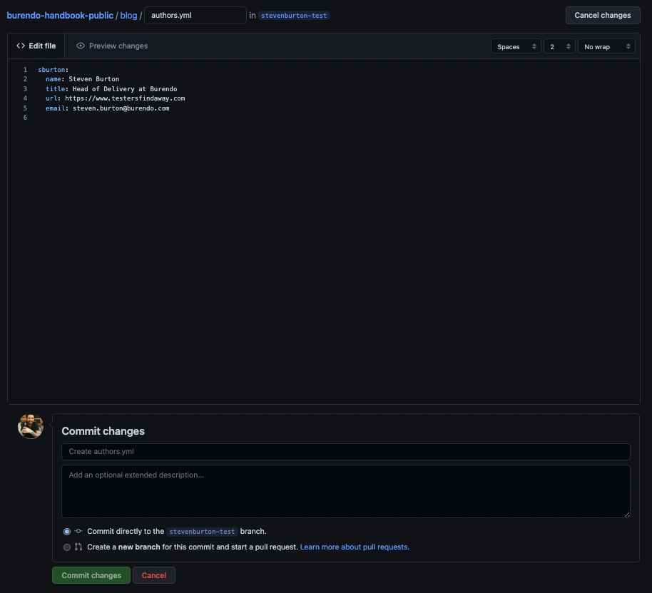

You don't need to worry about the language or syntax here because all you need to do is copy and paste a block of the code (i.e. copy and paste the `sburton` block with everything below is that is **indented**). Then change `sburton` on the pasted block to your initial and surname in lowercase and **edit the details for the new block to match your details, including the image url to the author picture name***. The `sburton` block will look something like the below as an example of what to copy:

```
sburton:
  name: Steven Burton
  title: Head of Delivery at Burendo
  url: https://www.testersfindaway.com
  email: steven.burton@burendo.com
  image_url: https://handbook.burendo.com/img/sburton.jpg
```

Once you have made the changes to this file, you can submit them as completed. This doesn't make them live yet so don't worry! In the `Commit changes` dialog, simply fill in the first box with a summary of the changes and then add a description. Leave the `Commit directly to the xxxxx branch.` option selected and click `Commit changes`!

&nbsp; <!-- Adds a new line  -->
### Write the blog

Now you will create your actual blog. This is the easiest way to do this:

- Open the last blog that is in the folder (i.e. the last one that starts with a date as a file name) to show something similar to below:

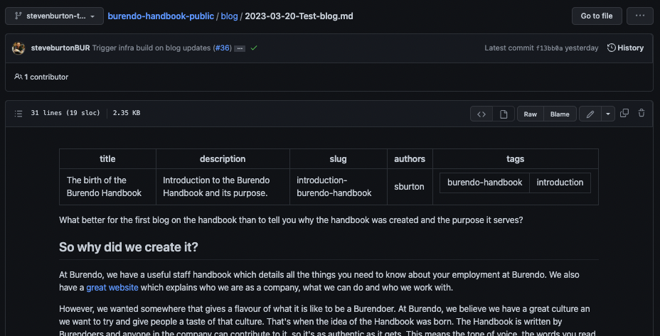

1. Click `Raw` to open the file in its raw data form
1. Copy the text at the top between the lines with `---` on
1. Click back on the browser
1. Go back to the `blog` folder
1. Click `Add file` and select `Create new file` from the drop down to show a screen similar to below:


- Paste the text you copied from the other blog to the top of your new file and edit the data to match (i.e. description, tags etc)
- Enter a file name with the following format: `YYYY-MM-DD-Name-of-blog.md`
- Write your blog - see the section on [markdown and submitting changes](#write-your-contribution-and-submit-changes)

&nbsp; <!-- Adds a new line  -->
## Write your contribution and submit changes

Documents are written in a language called "Markdown". Markdown is quite simply and not much different from writing in a wiki or similar. This guide doesn't deal with Markdown directly as there are many guides on the internet and [this](https://www.markdownguide.org/cheat-sheet/) is a handy cheat sheet I use a lot.

One of the areas people struggle with in Markdown is tables - one way is to use a handy [markdown table generator](https://www.tablesgenerator.com/markdown_tables) where you can create your table visually and then copy the Markdown code to clipboard and paste it in to your page.

Click the "Preview" button on the edit page to view what your page will look like when published, which gives you a view similar to this for the intro page:

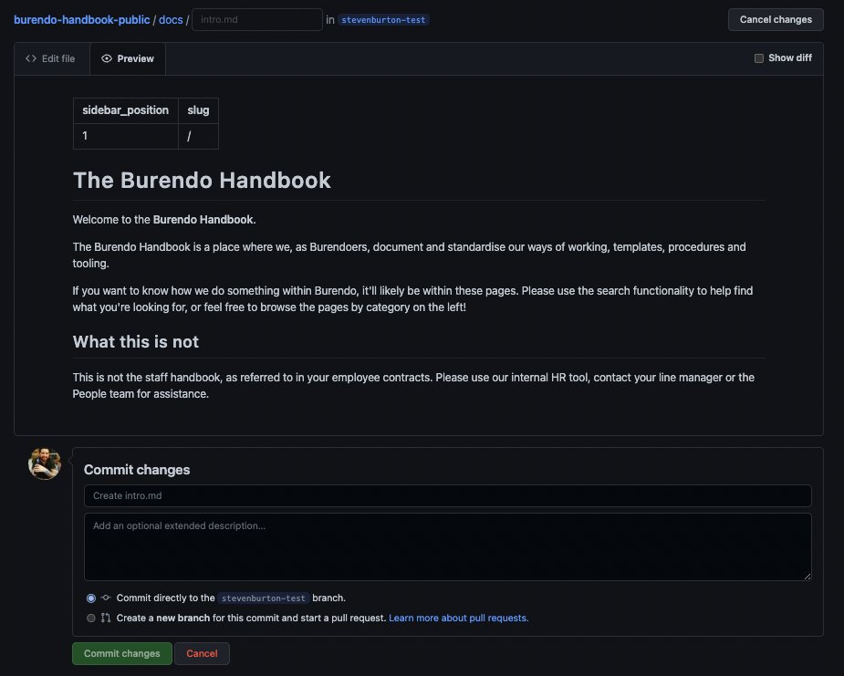


&nbsp; <!-- Adds a new line  -->
### Saving your work

Once you have made all the changes you wish to in your new or existing blog or document, you can submit them as completed. This doesn't make them live yet so don't worry! In the `Commit changes` dialog at the bottom of the page, simply fill in the first box with a summary of the changes and then add a description. Leave the `Commit directly to the xxxxx branch.` option selected and click `Commit changes`! For instance here is my commit message for my changes to `intro.md`:

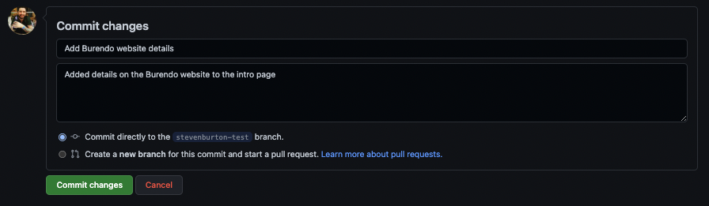

You may create more pages and/or edit more existing pages as you wish to for this contribution. Just ensure that on each one, you commit changes when done!


&nbsp; <!-- Adds a new line  -->
### Making further changes

All work that has been committed using the process [here](#saving-your-work) is saved and you can navigate away and go and sleep or do whatever you need to! In order to return to your work and make further changes [browse to the code again](#browse-to-code) and follow the [create a branch](#create-a-new-branch) instructions using the name of your _existing_ branch in order to select that one rather than creating a second one. Then browse to the files again to edit them further.


&nbsp; <!-- Adds a new line  -->
### All changes committed

When you have finished your contribution and created and edited all the new documents and blogs you want to and all your changes have been committed, you need to [finalise your contribution](#finalise-your-contribution).


&nbsp; <!-- Adds a new line  -->
### Adding images

Often you will want to upload new images so you can reference them in your page or blog. Firstly, you should ensure your images are named all lowercase (except an initial captial letter) with hyphens for spaces and is of type `png`. For example `This-is-an-image.png`.

Next, you need to navigate within the browser to your document where you will be referencing the image. **Within this folder**, click `Add file` from the top left drop down and click `Upload files`. For instance, if I was adding the images to the `roles-introduction.md` document, then I will add them as below:

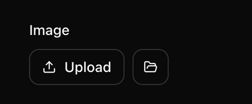

After clicking `Upload files` you will have a screen similar to the below:

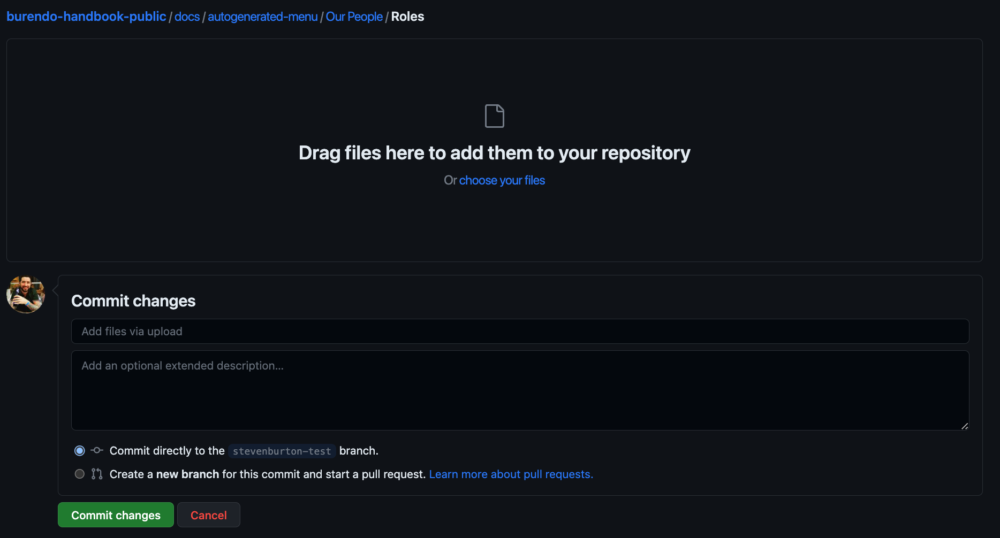

At this point there are two options, so ensure you select the right one:

1. [Images folder exists](#images-folder-exists) - when the folder your doc is in **already has** a sub-folder called `images`
1. [Images folder does not exist](#images-folder-does-not-exist) - when the folder your doc is in **does not have** a sub-folder called `images`


&nbsp; <!-- Adds a new line  -->
#### Images folder exists

If the `images` folder exists, simply drag and drop the photos to the upload box on this screen, then enter a title in the text box where it says `Add files via upload` that says what you are doing i.e. `Upload images for new roles document` and then add a longer description in the bigger next text box if you feel it is needed. Then click `Commit changes`.

You will now be back at the top level folder like this and will need to browse back to your document to edit it, following instructions at [editing documents](#edit-an-existing-document) to find the document.

To reference the images in the document following the instructions [here](#use-the-images-in-a-document).


&nbsp; <!-- Adds a new line  -->
#### Images folder does not exist

If the `images` folder does not exist, you need to **locally** create a folder called `images` (ensure the name is lowercase), then move all the images you wish to upload for this document in to that folder locally and then drag and drop the `images` folder itself to the upload box on this screen.

Then enter a title in the text box where it says `Add files via upload` that says what you are doing i.e. `Upload images for new roles document` and then add a longer description in the bigger next text box if you feel it is needed. Then click `Commit changes`.

You will now be back at the top level folder like this and will need to browse back to your document to edit it, following instructions at [editing documents](#edit-an-existing-document) to find the document.

To reference the images in the document following the instructions [here](#use-the-images-in-a-document).


&nbsp; <!-- Adds a new line  -->
#### Use the images in a document

When the images have been [uploaded](#adding-images), you can reference using the syntax `` i.e. for the image named `This-is-an-image.png`, you would add:

> ``

It's best to leave a new line before and after this text for readability and to ensure the image doesn't get muddled up within the text itself.


&nbsp; <!-- Adds a new line  -->
## Finalise your contribution

Now that all your changes are done, you can submit them for review! To do this, go to the route folder - the easiest way is to click on `burendo-handbook-public` on the breadcrumbs which appear on all pages like this:

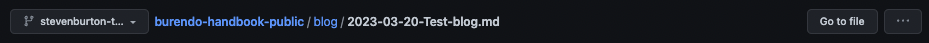

From here, you will see a page similar to below. Note the new green button at the top right:

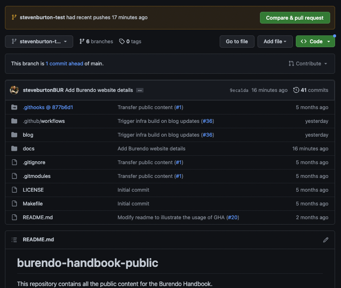

Click the big green button that says `Compare & pull request` and you will be taken to a screen similar to this:

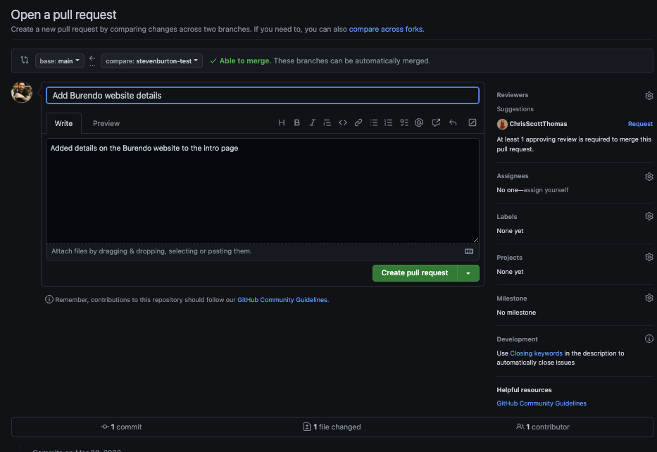

If you have only changed one file it's likely everything is filled in for you, like I have here. If not, then enter a title for the contribution, summing it up is the first text box and then describe all the changes in the bigger text box. When happy click on `Create pull request` to show a screen similar to below:

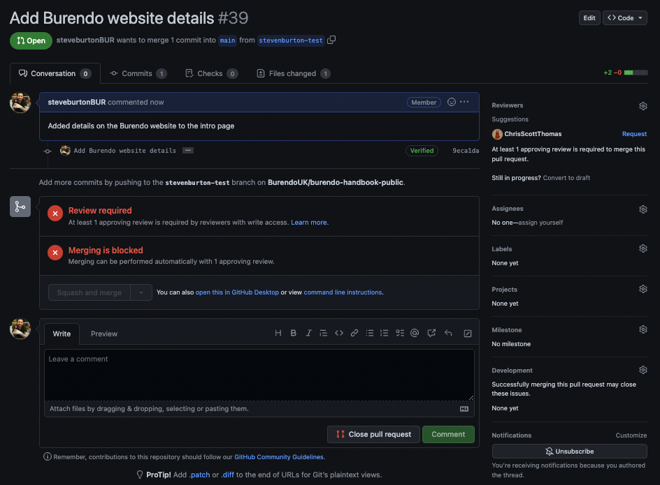

Now all you need to do is copy the URL to this page, go to the `#practice-engineering` channel in slack and post a message similar to below:

> `@here [URL] -> [Summary of contribution]`

Someone from the practice will pick up the pull request and review it. The review process is not covered here because the practice member who picks it up will work with you on this and have calls and screen shares where necessary. Often the review process needs no changes and your contribution is complete! When the review is complete, the practice member will merge your pull request and it will be live about 5 minutes later.

&nbsp; <!-- Adds a new line  -->
### After your contribution

Now you can spread the word and encourage others to contribute! If this guide needs updating please either make another contribution to update it or contact the engineering practice and let them know which bit was wrong or the areas you found most difficult to use. Your feedback is important in making this Handbook as easy to contribute to as possible.
