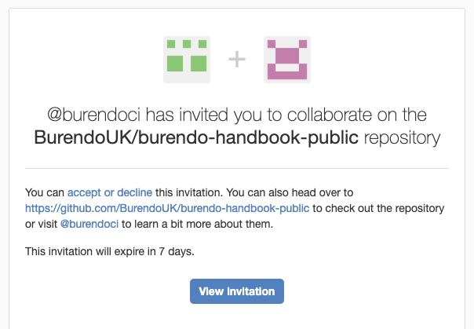
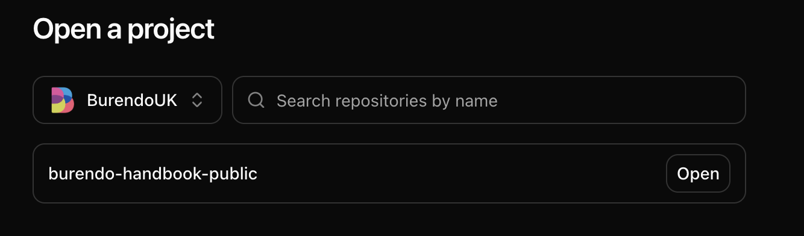
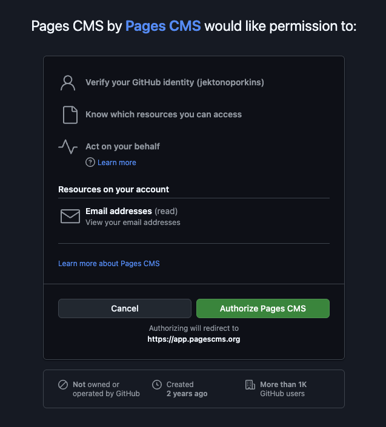
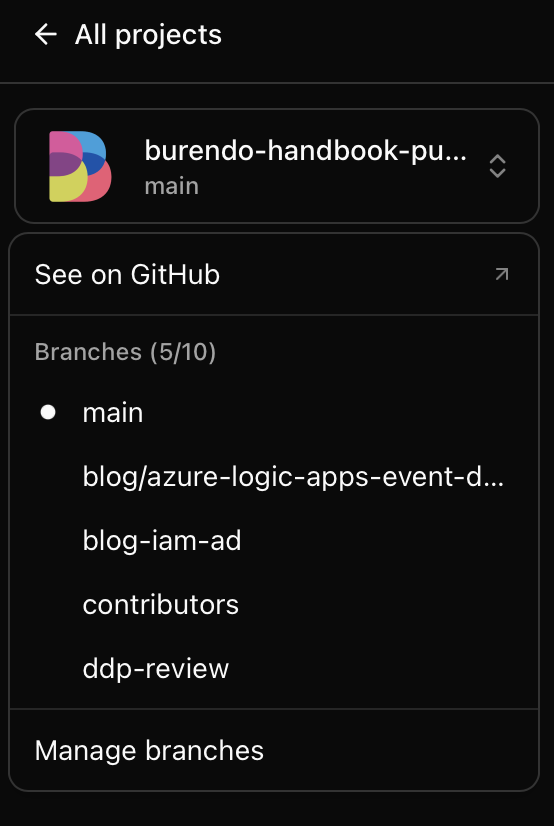
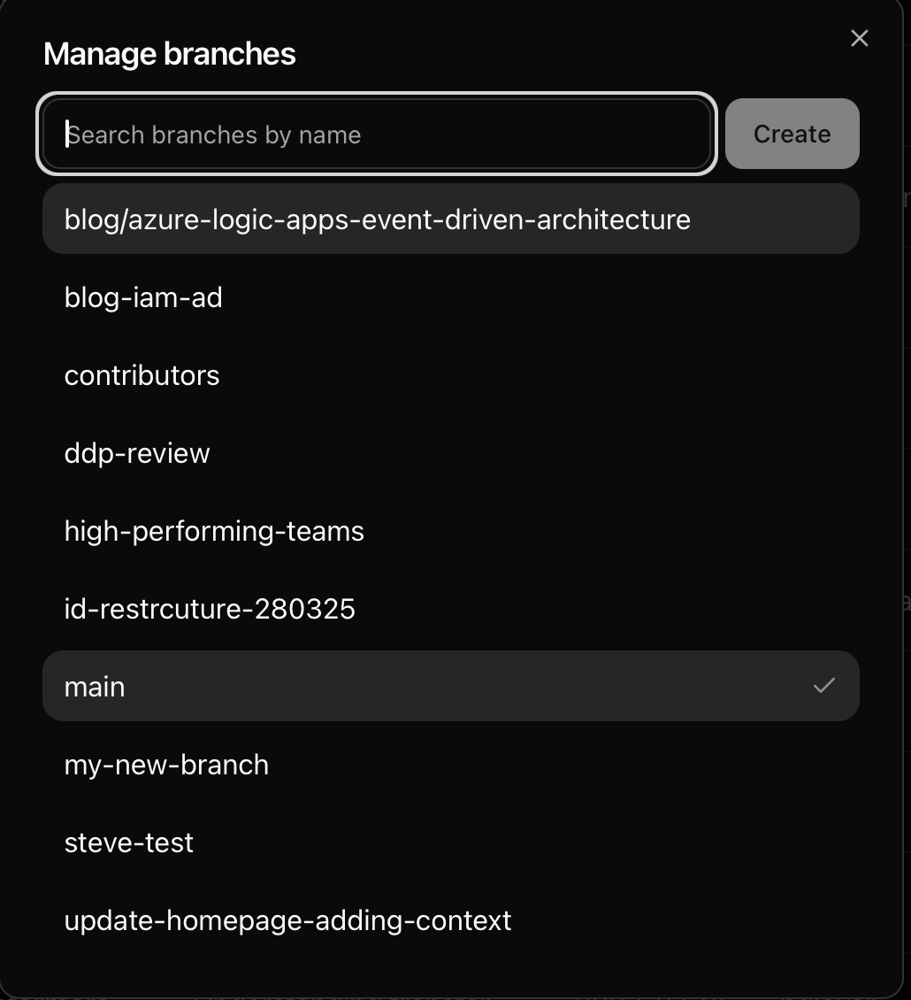

# Contributor guide

One of the founding principles of [The Burendo Handbook](intro.md) is that it is open to anyone to contribute. We try to make the process as simple as possible to do this, while still keeping some form of quality control on the contributions. We welcome contributions in certains areas from outside of Burendo. As the purpose of the Handbook is to be the voice of the Burendoers, most of the content comes from inside the company, however for any mistakes you spot, please feel free to fork the [public content repo](https://github.com/BurendoUK/burendo-handbook-public) and raise a Pull Request for us to review. The rest of this guide will concentrate on **contributions from inside Burendo**.

This guide is structured as below:

1. [Common actions](#common-actions) - the actions you need to perform to make _any_ changes
1. [Specific actions](#specific-actions) - the actions you need to perform to add different types of changes (i.e. blog, new documents, editing documents)
    - [Create a new document](#create-a-new-document) - create a new page in the Handbook.
    - [Edit an existing document](#edit-an-existing-document) - edit a page that currently exists in the Handbook.
    - [Create a new blog](#create-a-new-blog) - create a new blog entry on the Handbook.
1. [Write your contribution](#write-your-contribution-and-submit-changes) - add your contribution text using markdown syntax
    - [Adding images](#adding-images) - add an image and use it in your page or blog.
1. [Finalise your contribution](#finalise-your-contribution) - the actions you need to do to get your contribution live

&nbsp; <!-- Adds a new line  -->
## Common actions

The below actions will need to be done in order to make any contributions to the Handbook. Some things are one-time only so if you have contributed before, you can skip these steps.

&nbsp; <!-- Adds a new line  -->
### Create a GitHub account (one-time)

If you have not done this before you need to create yourself a GitHub account. In order to do this go to [GitHub's website](https://github.com/), click *"Sign Up"* and create a new account. You will need to use 2FA for the account and can set up now or will be prompted to later.

&nbsp; <!-- Adds a new line  -->
### Request access for content changes (one-time)

In order to get access to add or edit content:

1. Go to Burendo slack and join the `#practice-engineering` channel
1. Put a shout out with a `@engineering` for contributer access to the **public** section of the Handbook and include your GitHub username
1. One of the engineering practice will pick this up and let you know when done
1. You will get an email invitation to the email associated with your GitHub user - make sure to accept this invitation

&nbsp; <!-- Adds a new line  -->
### Engineer notes:
1. Add their GitHub username and a comment with their real name to `handbook_public_collaborators_github_usernames`.  Found in the `external-collaborators.tf` file in the `burendo-github-config` repo.
1. Raise a PR and get this approved and merged.

&nbsp; <!-- Adds a new line  -->
### GitHub Contributor invite
You will get an email invitation to join as an external collaborator to the BurendoUK organisation.  
  

Press View invitation, then accept then invitation in GitHub.

> *Note*: Once you have access to contribute to the public content, it stays with you while at Burendo, you do **not** need to request public contributor access every time

## Specific actions

Now you will need to select the type of contribution you wish to make and follow those instructions. You might be making multiple contributions in one go, in which case make all your contributions first, following the relevant instructions in this section and then go to [finalise your contribution](#finalise-your-contribution). The contribution types you can make are:

1. [Create a new document](#create-a-new-document) - create a new page for the Handbook.
1. [Edit an existing document](#edit-an-existing-document) - edit a page that currently exists in the Handbook.
1. [Create a new blog](#create-a-new-blog) - create a new blog entry on the Handbook.

&nbsp; <!-- Adds a new line  -->
### The CMS
We've set up PagesCMS to make editing the handbook easier.  You can find the CMS [here](https://app.pagescms.org/).  
Choose to login with GitHub.
You should see the following page:  



> *Note*: There seems to be an issue with GitHub invites.  If you don't see the option for `burendo-handbook-public`, you can accept the invite again via the following link: https://github.com/BurendoUK/burendo-handbook-public/invitations

You'll be prompted to authorise PagesCMS as a GitHub application.  Be sure to Authorise Pages CMS.  



Once you've authorised Pages CMS, you should be able to click `open` on the `burendo-handbook-public` option.

&nbsp; <!-- Adds a new line  -->
### Create a new branch

By default you will be on the `main` branch. This branch is considered to be the definitive branch, and its contents are what is displayed when visiting the Handbook proper.
You need to create a new branch to make your changes in. To do this, click the Burendo logo in the top left corner and choose `manage branches`.  



In the search bar provided you can type in the name of you new branch and click `Create`.  



It's best to use the format `YYYY-MM-DD-Name-of-contribution` - i.e. `2025-01-01-my-awesome-guide`.  Once you've clicked create, you will swap to that branch and can make your content changes.

> *Note*: If you have created a branch before and are coming back to edit, you follow the same steps but select the branch you created last time.

&nbsp; <!-- Adds a new line  -->
### The menu

Before you start, it's important to understand how the menu works. The things to know about the sidebar menu in the Handbook are:

- The menu is auto generated from the documents in the `docs` folders
- The document's title is used for the menu item text _or_ the document's file name is no title is present (the guide shows you how to add a title)
- Folders will create menu items which have sub-menu items that are the sub-folders or documents within that folder - i.e. _the folder hierarchy == the menu hierarchy_

&nbsp; <!-- Adds a new line  -->
## Create a new document

1. Choose the collection you wish to add your document to from the menu on the left
1. Click `Add an entry` button in the top right.  Files are create in the current folder, so ensure you're in the correct folder before doing so.
1. Once you've made changes use the `Save` button in the top right.  Failing to press this will lose your changes.

&nbsp; <!-- Adds a new line  -->
### Create a new document in a new folder

First, Click the Folder icon with a plus sign in the top right.  Enter the name of the folder you wish to create.  Ensure you're in the correct folder before doing so.
Navigate into that folder, before clicking the `Add an entry` button.

&nbsp; <!-- Adds a new line  -->
### Edit an existing document

> **NOTE:** Have you performed the [common actions](#common-actions) yet? If not, you need to do these first.

Navigate to the document you intend to edit, open it and make your changes.
Once you've made changes use the `Save` button in the top right.  Failing to press this will lose your changes.

&nbsp; <!-- Adds a new line  -->
## Create a new blog

> **NOTE:** Have you performed the [common actions](#common-actions) yet? If not, you need to do these first.

Blogs are all kept in a flat file structure.
Block Blogs on the left hand side, then `Add an entry` button in the top right.

&nbsp; <!-- Adds a new line  -->
#### Add author picture

To add an author picture, find a head shot of yourself, name it `initialsurname.png` similar to `sburton.png`.  Click the `Authors Pictures` in the menu on the left hand side.  Upload your picture.

&nbsp; <!-- Adds a new line  -->
#### Edit authors file

To edit the authors file, click `Authors` in the menu on the left hand side.

You don't need to worry about the language or syntax here because all you need to do is copy and paste a block of the code (i.e. copy and paste the `sburton` block with everything below is that is **indented**). Then change `sburton` on the pasted block to your initial and surname in lowercase and **edit the details for the new block to match your details, including the image url to the author picture name***. The `sburton` block will look something like the below as an example of what to copy:

```
sburton:
  name: Steven Burton
  title: Head of Delivery at Burendo
  url: https://www.testersfindaway.com
  email: steven.burton@burendo.com
  image_url: https://handbook.burendo.com/img/authors/sburton.jpg
```

> **NOTE:** Ensure your block of text has similar indentation (using tabs) as the other blocks in the file.

Once you have made the changes to this file, click the Save button.

&nbsp; <!-- Adds a new line  -->
### Write the blog

Now you will create your actual blog.

- Write your blog.
- Once you've made changes use the `Save` button in the top right.  Failing to press this will lose your changes.

&nbsp; <!-- Adds a new line  -->
### Adding images

Often you will want to upload new images so you can reference them in your page or blog. Firstly, you should ensure your images are named all lowercase (except an initial captial letter) with hyphens for spaces and is of type `png`. For example `This-is-an-image.png`.

Within the document your editing is an Image field.  You can click the `Upload files` button to upload your images, or click the folder icon to browse for an existing image.


To use the image in your document, on a new line type `/` and choose the image option.  Choose the image you wish to use.


It's best to leave a new line before and after this text for readability and to ensure the image doesn't get muddled up within the text itself.

&nbsp; <!-- Adds a new line  -->
## Finalise your contribution

Now that all your changes are done, you can submit them for review! To do this, click the Burendo symbol in the top left.  DIrectly underneath that click `See on GitHub`.

From here, you will see a page similar to below. Note the new green button at the top right:


Click the big green button that says `Compare & pull request` and you will be taken to a screen similar to this:


If you have only changed one file it's likely everything is filled in for you, like I have here. If not, then enter a title for the contribution, summing it up is the first text box and then describe all the changes in the bigger text box. When happy click on `Create pull request` to show a screen similar to below:


Now all you need to do is copy the URL to this page, go to the `#practice-engineering` channel in slack and post a message similar to below:

> `@here [URL] -> [Summary of contribution]`

Someone from the practice will pick up the pull request and review it. The review process is not covered here because the practice member who picks it up will work with you on this and have calls and screen shares where necessary. Often the review process needs no changes and your contribution is complete! When the review is complete, the practice member will merge your pull request and it will be live about 5 minutes later.

&nbsp; <!-- Adds a new line  -->
### After your contribution

Now you can spread the word and encourage others to contribute! If this guide needs updating please either make another contribution to update it or contact the engineering practice and let them know which bit was wrong or the areas you found most difficult to use. Your feedback is important in making this Handbook as easy to contribute to as possible.
